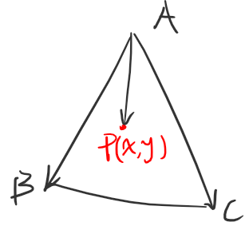
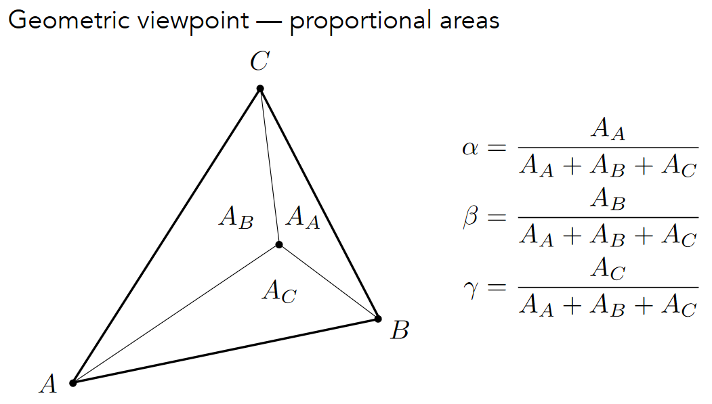
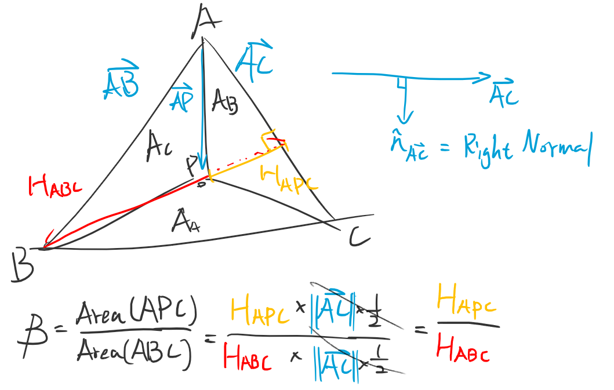
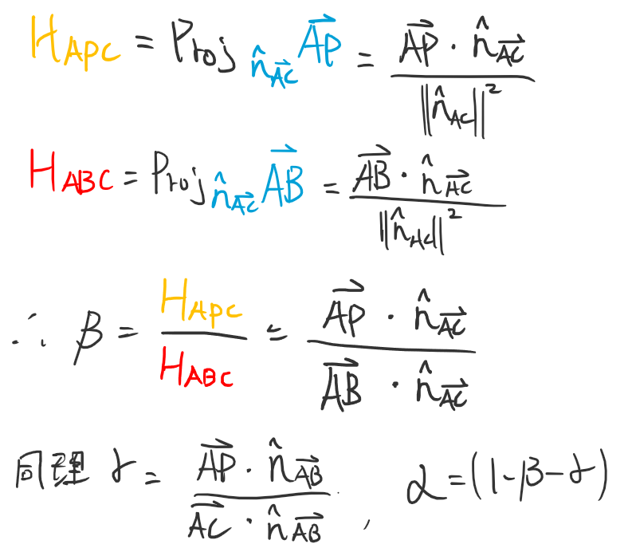
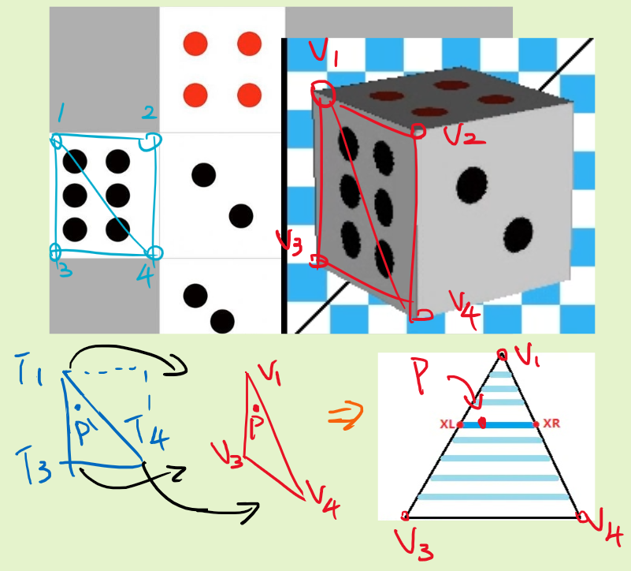



## 定義



平面三角形T有A、B、C頂點，而內部的任一點P，都可以透過ABC三點的**線性組合**來表示，所以P點表示法如下:

$$  \overrightarrow{AP}=u\overrightarrow{AB}+v\overrightarrow{AC} $$

將它分解整理後:
$$ P-A=u(B-A)+v(C-A) $$

最終得到:
$$ P(x,y) = (1-u-v)A + uB + vC~,~~0\leq u,v\leq 1$$ 

如果將A、B、C的三個係數換一下，就變成:

$$ P(x,y)= \alpha A + \beta B +\gamma C~,~~\alpha+\beta+\gamma=1 $$

而這就是重心座標的表示法，透過 $[\alpha,\beta,\gamma]$ 這三個介於[0,1]之間的係數，來決定P在三角形內部的**相對位置**

線上操作範例: [Barycentric coordinates of a point](https://www.geogebra.org/m/ZuvmPjmy)

<br>

首先第一個問題就是，有了三角形ABC與內部的P點，要怎麼求出對應的係數?


## 推導方式 1. 外積

將原式改寫，可以把P點看成是起點為A，透過$\overrightarrow{AB},\overrightarrow{AC}$為基底的座標為$(u,v)$:
$$ P = A + u\overrightarrow{AB}+v\overrightarrow{AC} $$
找到滿足此條件的$u,v$
$$ u\overrightarrow{AB}+v\overrightarrow{AC}+\overrightarrow{PA} = 0 $$
平面三角形的座標拆開成$(x,y)$分量

$$
\begin{cases} 
u\overrightarrow{AB}.{x} + v\overrightarrow{AC}.{x} + \overrightarrow{PA}.{x} = 0 \\\\ 
u\overrightarrow{AB}.{y} + v\overrightarrow{AC}.{y} + \overrightarrow{PA}.{y} = 0
\end{cases}
$$

以矩陣表示:
$$
\begin{cases} \begin{bmatrix}u & v & 1  \end{bmatrix} \begin{bmatrix} \overrightarrow{AB}.{x} \\\\ \overrightarrow{AC}.{x} \\\\ \overrightarrow{PA}.{x} \end{bmatrix}=0 \\\\ \\\\ \begin{bmatrix}u & v & 1  \end{bmatrix} \begin{bmatrix} \overrightarrow{AB}.{y} \\\\ \overrightarrow{AC}.{y} \\\\ \overrightarrow{PA}.{y} \end{bmatrix}=0 \end{cases}
$$

可以發現兩條式子的點積都為0，表示$[u,v,1]$這個向量，同時垂直於$x$分量與$y$分量，這就代表$[u,v,1]$剛剛好就是x分量與y分量的外積(Cross)


另變數 `uv` 為$[u,v,c]$ = $(\overrightarrow{AB}.{x} , \overrightarrow{AC}.{x} , \overrightarrow{PA}.{x}) \times (\overrightarrow{AB}.{y} , \overrightarrow{AC}.{y} , \overrightarrow{PA}.{y})$ 的結果

但這裡要注意的是，`uv`得到的外積結果，僅僅是方向正確，確實垂直於x與y分量的向量，但大小卻不一定正確，不過 $c$ 的值已經知道是1了，所以只要讓uv的值要再進行縮放，讓 $c = 1$ 就是正確的 $uv$

將$[u,v,c]$帶回:
$$ u\overrightarrow{AB}+v\overrightarrow{AC}+c\overrightarrow{PA} = 0 $$

$c$ 的值應該要為1，同除以 $c$ 得到:
$$ \frac{u}{c}\overrightarrow{AB}+\frac{v}{c}\overrightarrow{AC}+\overrightarrow{PA} = 0 $$
展開將P拿出來，最終得到完整式子:
$$ P = (1-\frac{u}{c}-\frac{v}{c})A + \frac{u}{c}B + \frac{v}{c}C~,~~c\neq 0 $$

也就是:
$$ P= \alpha A + \beta B +\gamma C~,~~\alpha+\beta+\gamma=1 $$
其中:
$$ \begin{cases}  & \alpha=1-\frac{u}{c}-\frac{v}{c} \\\\   & \beta= \frac{u}{c} \\\\  & \gamma= \frac{v}{c} \end{cases} $$

程式碼:
```cpp
// 透過外積法計算向量座標
Vec3f barycentric(Vec2f A, Vec2f B, Vec2f C, Vec2f P) {
    // Vec3f [x,y,z] = [u,v,c]
    Vec3f vec_x(B.x - A.x, C.x - A.x, A.x - P.x); // vAB.x,vAC.x,vPA.x
    Vec3f vec_y(B.y - A.y, C.y - A.y, A.y - P.y); // vAB.y,vAC.y,vPA.y
    Vec3f uv = cross(vec_x, vec_y);	

    // 不得除以0，做個檢查，因為浮點數可能會有誤差，所以給定一個範圍
    if (std::abs(uv[2]) > 1e-2){
        float alpha = 1.f - (uv.x + uv.y) / uv.z;
        float beta = uv.y / uv.z;
        float gamma = uv.x / uv.z;
        return Vec3f(alpha, beta, gamma);
    }
    // uv.z為0的狀況為異常，傳回不符合定義的值，讓rasterizator捨棄這個點
    return Vec3f(-1, 1, 1); //通常不會發生
}
```

<br>

## 推導方式 2. 面積比



$\alpha, \beta ,\gamma$ 為A,B,C頂點對邊的面積比，詳細證明待補，面積比有兩種大致的推導方法:
1. 直接行列式求面積去算$\alpha$=Area(BPC)/AREA(ABC) [參考](https://blog.csdn.net/qq_38065509/article/details/105446756)
2. 找出AC邊的法向量N，將AP投影到N上，即可得到AC到P點的高，而底邊就是|AC|，將高乘以底邊就是Area(APC)的面積，剩下就一樣求出面積比

1.的方法很直觀不用推了，簡單推導2.的方法:
 

而計算完的參數直接就是$[\alpha,\beta,\gamma]$了，不用像外積法要多一步

$$ P= \alpha A + \beta B +\gamma C~,~~\alpha+\beta+\gamma=1 $$

```cpp
// 透過面積計算重心座標
Vec3f barycentric(Vec2f A, Vec2f B, Vec2f C, Vec2f P) {
    auto ab = B - A;
    auto ac = C - A;
    auto ap = p - A;

    Vec2f nac(A.y - C.y, - A.x + C.x);
    Vec2f nab(A.y - B.y, - A.x + B.x);

    float beta = (ap * nac) / (ab * nac); // operator* is dot
    float gamma = (ap * nab) / (ac * nab);
    float alpha = 1.f - beta - gamma;

    return Vec3f(alpha, beta, gamma);
}
```

<br>

## 基本使用

基本轉換:
-   已知三頂點A,B,C位置與**絕對位置**P點，要如何得出**相對位置**的比例參數 $[\alpha,\beta,\gamma]$ ?<br>
    直接帶入前面完成的bary函式bary(A,B,C,P)，得到計算後傳回的 $[\alpha,\beta,\gamma]$

-   已知A,B,C頂點與**相對位置**參數 $[\alpha,\beta,\gamma]$ 或是 $[u,v]$，如何得到**絕對位置**P點?<br>
    直接將參數與頂點代入定義即可:<br>
    $ P= \alpha A + \beta B +\gamma C $ <br>
    $ P= (1-u-v)A + uB + vC $

<br>

## 應用方式

紋理貼圖:



如上圖，希望能將左邊藍色的貼圖，映射到右邊的紅色模型上，這過程稱為紋理貼圖或是貼皮，而此時會有幾個問題

1. 紅色三角形已經過座標變換，掃描線準備上色時會有一個動點P，如何知道三角形中所有P點對應的貼圖顏色?
2. 兩片三角形已經大不相同，要如何在不影響圖形比例的情況將其著色?

掃描線的動畫圖解: [Rasterizer Algorithm Explanation](https://www.youtube.com/watch?v=t7Ztio8cwqM)


大略步驟:
1. 透過Barycentric(V1, V3, V4, P)，得到P點在紅色三角形的相對位置(u, v)
2. 帶入貼圖三角形T中 $P'= (1-u-v)T_{1} + u~T_{2} + v~T_{4}$ 取得$P'$點座標，也就能取得貼圖於P(x,y)的顏色
3. 最後就能取得紅色P點對應的貼圖顏色，如此反覆將P隨著掃描線計算，即可取得整片三角形的貼圖對應

重複此過程渲染兩片三角形後，就能將骰子點數6的這一面印出

<br>

## 結論
暫無，之後再補

---

## Reference
- Fundamentals of Computer Graphics 4th
- [Tiny Renderer:Triangle rasterization and back face culling](https://github.com/ssloy/tinyrenderer/wiki/Lesson-2:-Triangle-rasterization-and-back-face-culling)
- [GAMES101-现代计算机图形学入门-闫令琪](https://sites.cs.ucsb.edu/~lingqi/teaching/games101.html)
- [计算机图形学三(补充)：重心坐标(barycentric coordinates)详解及其作用](https://blog.csdn.net/qq_38065509/article/details/105446756)
- [Barycentric Coordinates](https://observablehq.com/@infowantstobeseen/barycentric-coordinates)