# 遊戲中的碰撞檢測Collision Detection

<!-- 錨點規則: 空格替換為"-" 標題中其餘符號直接省略 -->
<!-- ## 目錄
1. [矩形碰撞檢測](#1-矩形碰撞檢測)
2. [什麼是分離軸檢測?](#2-什麼是分離軸檢測)
3. [知識補充1–向量](#3-知識補充1向量)
4. [知識補充2–旋轉變換](#4-知識補充2旋轉變換)
5. [如何取得分離軸上的投影?](#5-如何取得分離軸上的投影)
6. [編寫程式碼-投影、旋轉與判斷](#6-編寫程式碼-投影旋轉與判斷)
7. [如何取得分離軸?](#7-如何取得分離軸)
8. [粗糙的矩形檢測](#8-粗糙的矩形檢測)
9. [編寫程式碼–多邊形與多邊形](#9-編寫程式碼多邊形與多邊形)
10. [編寫程式碼–多邊形與圓](#10-編寫程式碼多邊形與圓)
11. [SAT的總結](#11-sat的總結)
12. [多物體的碰撞優化](#12-多物體的碰撞優化)
13. [動態物體間的碰撞檢測](#13-動態物體間的碰撞檢測)
14. [Source Code](#14-source-code)
15. [結尾感想](#15-結尾感想)
16. [參考資源](#參考資源) -->



而這篇文有三個主要目的 :
1. 對遊戲中的碰撞感興趣，卻不會寫程式的人可以了解原理
2. 讓有能力實作的人，可以跟著文章寫出精確的多邊形碰撞檢測
3. 自己的學習筆記

讓我們開始吧。

這次要來介紹的主題是分離軸碰撞檢測(Separating Axis Theorem, SAT)<br>
分離軸定理通常用語檢測兩個多邊形或多邊形與圓之間的碰撞，跟所有演算法一樣他具有一定的優勢與缺點。<br>
我會慢慢講解背後的原理，並使用程式碼做簡易的範例。

範例所使用的語言為Java Script，加上自製的向量函式庫，但我想觀念懂了應該不會有太大問題。


## 1. 矩形碰撞檢測

我想先從最簡單的碰撞檢測開始講，這樣比較好讓各位了解為什麼需要分離軸檢測，所以先從一般的矩形碰撞開始。


AABB碰撞檢測(Axis-aligned Bounding Box):
為了方邊物體之間進行碰撞檢測運算，通常會對物體創建一個長方形將其包圍，AABB包圍盒也被稱為軸對齊包圍盒。

一般二維的AABB包圍盒具備兩項特點:

1. 以矩形包圍物體
2. 矩形的每條邊，皆與坐標系的軸垂直

簡單來說就是用矩形把物體包起來，檢查矩形之間是否發生碰撞

如下圖，黑框及為包圍盒，在做碰撞檢測時，只需要檢查包圍盒之間是否發生碰撞:

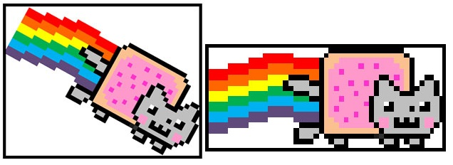

那我們就直接來看看AABB碰撞盒是如何運作的吧。

這裡有兩個矩形A、B，Box A最小邊為A.min、最大邊為A.max，而Box B同理。

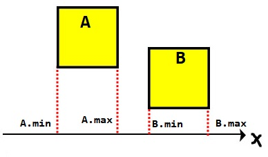

如上圖所示，當A.max < B.min時，代表兩物體之間仍有縫隙，沒有發生碰撞。

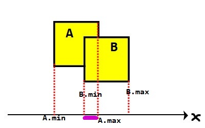

上圖可以明顯地看到A與B發生碰撞，當**A.max > B.min**時，代表兩物體之間沒有縫隙，發生碰撞。

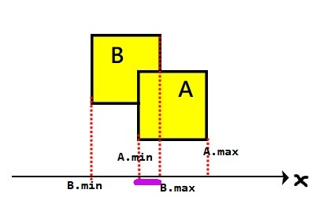

但前面只討論B在A右側，當B在A的左側時，條件就要稍微改一下，當B在A的左側時，B.max > A.min時發生碰撞。

將兩張圖的結果合在一起，整理成code:
```js
if (A.max > B.min && B.max > A.min)
    Console.log("Collided");
```
為什麼使用 AND 來判斷?

只要A在B的右邊，那麼A.max就會永遠大於B.min，因為A.max > B.min是用在A在左邊的碰撞判斷，所以只要沒有發生碰撞，就代表只有一個條件會是True，碰撞無法成立，所以使用 AND。

那麼當A在B的上面或下面呢?

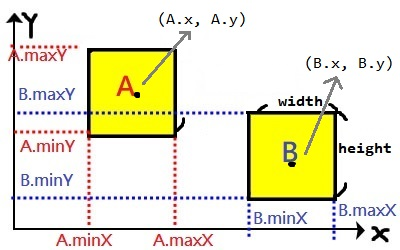

方法是一樣，對Y軸上的min、max判斷即可。

讓我們對著圖片來看程式碼 :
```js
function RectCollision(r1, r2) {
    // 這邊因為(X,Y)在方塊中心，所以在取得min、max時，要 +/- width/2
    // Rect1
    var minX1 = r1.x - r1.width / 2,
        maxX1 = r1.x + r1.width / 2,
        minY1 = r1.y - r1.height / 2,
        maxY1 = r1.y + r1.height / 2;
    // Rect2
    var minX2 = r2.x - r2.width / 2,
        maxX2 = r2.x + r2.width / 2,
        minY2 = r2.y - r2.height / 2,
        maxY2 = r2.y + r2.height / 2;
 
    if (maxX1 > minX2 && maxX2 > minX1 &&
        maxY1 > minY2 && maxY2 > minY1) {
        return true;
    }
    else
        return false;
}
// 完整原始碼在結尾與感想的最後。
```
測試結果:
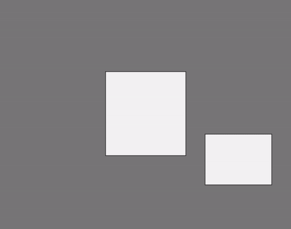


那麼另外一種情況如何?
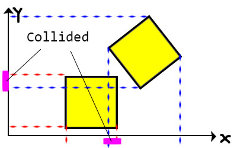
如上圖，我們能明顯的看出兩物體沒有發生碰撞，但是用**AABB**碰撞檢測，答案卻是…發生碰撞。

AABB碰撞檢測算法雖然計算方法簡單、速度快，但卻有幾個問題:
1. **當物體旋轉時就無法檢查**
2. **只能檢查矩型物體**

那麼要如何解決這兩個問題呢?<br>
就是本文的主題「SAT碰撞檢測」，這個方法可以完美的解決這兩個問題。

 
讓我們進入下一階段。

## 2. 什麼是分離軸檢測?

如果有兩個凸多邊形，在任意角度下的投影皆有重疊，代表物體發生碰撞，否則只要有縫隙，就代表沒有碰撞。

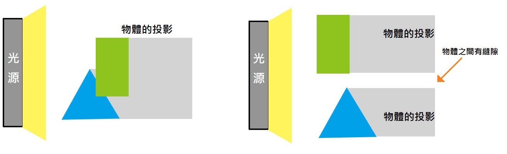

簡單來說，就是如果能在兩個物體間找到一條線來分離它們，那麼就代表這兩個物體之間沒有發生碰撞。

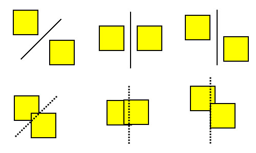

上圖中你可以看到第一排的物體之間有縫隙，所以能夠輕鬆地畫出一條線來分離它們，但第二排就沒辦法，因為這兩個物體已經相撞，之間沒有縫隙，所以找不出一條線來當分離線。

而分離線不只一條 :

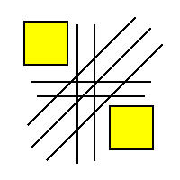

到目前為止已經大概了解什麼是分離線，那要如何利用分離線來做碰撞檢測? 很簡單，只要檢查兩物體之間是否存在分離線即可，因為只要**找到一條分離線就代表物體之間有縫隙**，表示沒有發生碰撞。

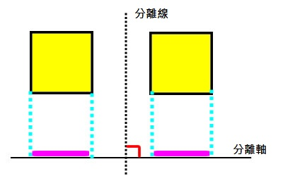

而所謂的分離軸就是與分離線垂直的一條線，**透過分離軸上物體的投影是否重疊**，來判斷是否發生碰撞。

所以我們能透過分離軸檢查旋轉的物體。

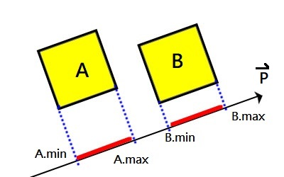

假設向量P是45度的延長線，由上圖可知，如果我們將A、B的「**四個角投影在P向量上**」，可以得到它們的min、max，接下來就能透過min、max來判斷碰撞。

這時應該會有幾個問題:
1. 如何取得分離軸上的投影min、max?
2. 如何取得分離軸P?

但是在解決那兩個問題前，先來看看前面這段話「**四個角投影在P向量上**」:
1. 要如何取得旋轉後的4個角?
2. 要如何計算其中一個角落在P向量上的投影?

所以在前往下一個階段之前，要先補充一些數學的知識。

## 3. 知識補充1–向量

知識補充1與2這兩段，可以先跳過，不影響閱讀，等到有看不懂的地方再回來看也行。<br>
為了解釋如何取得投影與分離軸，所以需要先補充向量的知識。

數學向量忘記的話，這裡推薦幾部教學影片:

南投高中數學課 : [向量內積公式說明](https://goo.gl/cpzCv5)、[單位向量的說明](https://goo.gl/JPFro9)

Q仔高中數學教室 : [向量的內積](https://goo.gl/DbnBpW)、[向量內積的幾何意義與座標表示法](https://goo.gl/YiuzVz)

向量的內積:
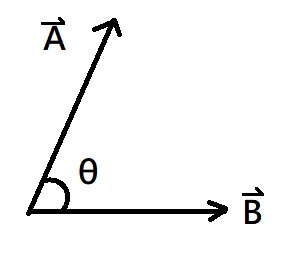

我們可以透過兩向量之間的夾角來計算點積:
$$
A\cdot B=\left | A \right |\left | B \right |cos \theta 
$$
或使用座標來計算:
$$
\vec{A}\cdot \vec{B}=A_{x}B_{x}+A_{y}B_{y}
$$
有了這兩個公式後，就可以開始來證明文章需要的公式了

### 正射影 :
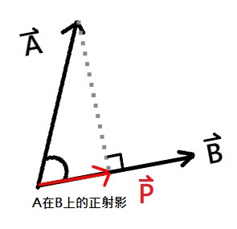
$$
A\cdot B=\left | A \right |\left | B \right |cos \theta 
$$
$$
cos \theta = \frac{A\cdot B}{\left | \vec{A} \right |\left | \vec{B} \right |}=\frac{\left |\vec{P}  \right |}{\left |\vec{A}  \right |}
$$
然後我們就會得到向量P的長度
$$
\left |\vec{P}  \right |=\frac{(\vec{A} \cdot \vec{B})\left |\vec{A}  \right |}{\left |\vec{A}  \right |\left |\vec{B}  \right |}=\frac{\vec{A}\cdot \vec{B}}{\left |\vec{B}  \right |}
$$
但這裡求出的P是長度(正射影長)，只有大小，沒有方向

回到上圖可以觀察出P向量的方向是延著B向量，所以只要讓 純量P 乘上 單位向量B，就能得到A在B上的正射影。
$$
\vec{P} = \frac{\vec{A} \cdot \vec{B}}{\left | \vec{B} \right |}\ast \frac{\vec{B}}{\left | \vec{B} \right |}=\frac{(\vec{A} \cdot \vec{B})\vec{B}}{\left | \vec{B} \right |^{2}}
$$

所謂的單位向量就是大小為1的方向向量，而純量只有大小，兩個相乘即可得到長度為P且方向為B的向量 (如果還是不太懂的話可以自己畫圖證明看看)。

所以正射影是**A向量在B向量上的分量**。

了解正射影後，就能取得物體在分離軸上的投影了。

### 法向量 :

定義:垂直於平面的向量。

$$
\vec{A}\cdot \vec{B}=A_{x}B_{x}+A_{y}B_{y}
$$

從點積公式可以得出，**當兩向量垂直時，向量內積會是零**。

 

假設A向量為(3, 4)，求A的法向量，那麼我們只要將A帶進去，並湊一個能滿足等式為零的參數就是法向量。

$$
(3)(B_{x}) + (4)(B_{y}) = 0
$$

這時B向量會有無限多組合，但是有其中兩組(4, -3)、(-4, 3)，**剛好就是A向量的座標互換並加負號**。

所以我們可以得到下圖結果:
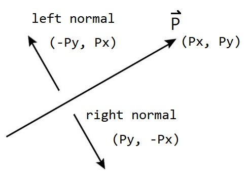

了解如何取得法向量後，就能取得需要檢查的分離軸了。

有了向量、內積、正射影長、法向量這些基本資訊後，先來建立一個簡易的向量函式庫吧
```js
function Vector(x, y) {
    this.x = x;
    this.y = y;
}
// 取得這個自己的長度
Vector.prototype.length = function () {
    return Math.sqrt(this.x * this.x + this.y * this.y);
}
// 取得自己與vec2的內積
Vector.prototype.dot = function (vec2) {
    return this.x * vec2.x + this.y * vec2.y;
}
// 取得自己在vec2上的正射影長
Vector.prototype.projectLengthOnto = function (vec2) {
    var dotProduct = this.dot(vec2);
    var len = vec2.length();
    return dotProduct / len;
}
// 取得自己的左法向量
Vector.prototype.normalL = function () {
    return new Vector(-this.y, this.x);
}
// 取得自己的右法向量
Vector.prototype.normalR = function () {
    return new Vector(this.y, -this.x);
}
```
使用方式:
```js
var vec1 = new Vector(3, 4);// 建立vec1向量
var vec2 = new Vector(1, 0);// 建立vec2向量
vec1.length() // => 5
vec1.dot(vec2) // => 3
vec1.projectLengthOnto(vec2) // =>3
vec1.normalL() // = (-4, 3)
vec1.normalR() // = (4, -3)
```

## 4. 知識補充2–旋轉變換

為了解釋如何取得物體旋轉後的角落，所以需要先補充旋轉變換的知識。

其作用為以原點為中心旋轉θ角:
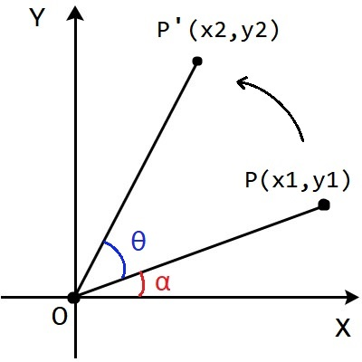

如上圖，座標平面上$L = \overline{OP}$
且點$P(x_{1}, y_{1})$滿足$x_{1} = L*\cos \alpha, y_{1} = L*\sin \alpha$

那麼，以原點O為中心，將這個點以逆時針旋轉 $\theta$角後得到${P}'(x_{2}, y_{2})$

方法一:

先取得$\overline{OP}$與$\alpha$，那麼${P}'$就是$( L*\cos (\alpha +\theta ), L*\sin (\alpha +\theta ) )$

但在電腦中取得OP長要透過畢氏定理開根號來取得，加上只有P點不知道α角的時候，要用Math.atan2(y, x)先取得α的角度後再計算，比較麻煩。

所以有一個改良版:
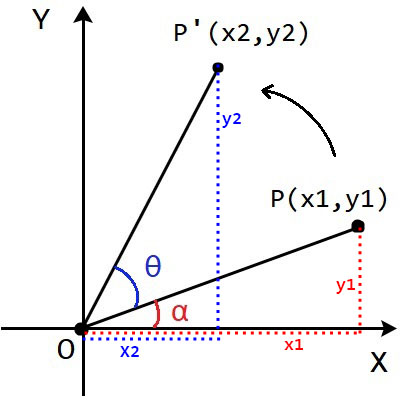

和角公式:

$$
\begin{cases} 
\cos(\alpha+\theta )= \cos \alpha \cos \theta - \sin \alpha \sin \theta \\\\ 
\sin(\alpha+\theta ) = \sin \alpha\cos \theta + \cos \alpha\sin \theta
\end{cases}
$$

所以

$$
\begin{cases} 
\cos(\alpha+\theta ) = \frac{x_{2}}{L} = \frac{x_{1}}{L}\times \cos\theta - \frac{y_{1}}{L} \times \sin\theta \\\\ 
\sin(\alpha+\theta ) = \frac{y_{2}}{L} = \frac{y_{1}}{L}\times \cos\theta - \frac{x_{1}}{L} \times \sin\theta
\end{cases}
$$

同乘L後即可得到
$$
\begin{cases} 
x_{2}= x_{1}\cos \theta-y_{1} \sin\theta \\\\ 
y_{2}= y_{1}\cos \theta+x_{1} \sin\theta
\end{cases}
$$

而這個就是我們要的旋轉公式

矩陣表示法:

$$
\begin{bmatrix} x_{2} \\\\ y_{2} \end{bmatrix} = \begin{bmatrix}\cos \theta &  - \sin \theta \\\\ \sin \theta & \cos \theta \end{bmatrix}\begin{bmatrix} x_{1} \\\\ y_{1} \end{bmatrix}
$$

而這矩陣就是所謂的旋轉矩陣，未來電腦圖學會很常用到。

<br>

講解完後，把這段公式加入我們的向量函式庫吧。

angle為弧度，並以原點(0,0)為中心旋轉angle角:
```js
Vector.prototype.rotate = function (angle) {
    var new_x = (this.x * Math.cos(angle)) - (this.y * Math.sin(angle));
    var new_y = (this.x * Math.sin(angle)) + (this.y * Math.cos(angle));

    this.x = new_x;
    this.y = new_y;
}
```

## 5. 如何取得分離軸上的投影?

有了投影公式後，接下來只要把A、B的四個角投影在P向量上就能知道min、max了。


這時卻出現了一個狀況，如果兩個物體方向不一樣呢?

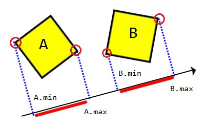

由上圖可知，當兩物體方向不同時，只要在**4個角落中選一個最小和最大的**，就是min、max。

那我們要如何透過投影來判斷碰撞?

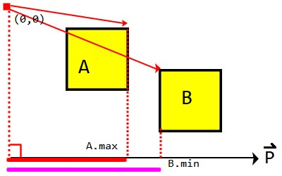

由上圖可以看到，A.max、B.min在P向量上的投影圖。

當B.min > A.max時，代表他們之間有分離線，所以沒有碰撞。當位置交換時，A.min > B.max時代表有間距。

讓我們把結果整理成code :
```js
if (B.min > A.max || A.min > B.max)
    Console.log("分離");// isSeparated
else
    Console.log("碰撞");// isCollided
```
這邊選擇True為分離是因為這是分離軸檢測，我認為這樣比較符合。

了解如何取得min、max，並如何判斷後，就可以進入下個階段了。


## 6. 編寫程式碼-投影、旋轉與判斷

第一步，我們需要取得矩形上的四個角，這時就需要前面的「知識補充2-旋轉變換」

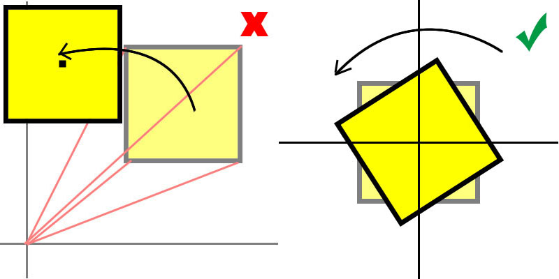

如果直接將四個角套用旋轉公式的話，就會像左圖一樣，物體繞中心旋轉。

但我們想要的是右圖中，物體原地旋轉的效果，所以要將旋轉公式做點更動。

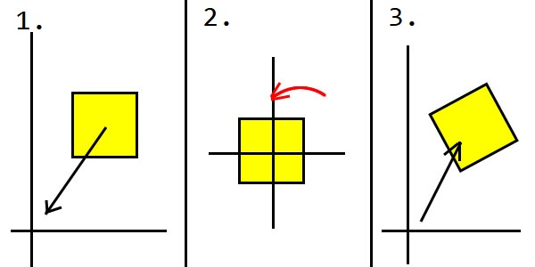

如上圖的步驟，我們需要的旋轉是**以矩形中心為參考點做旋轉**，而原公式以原點做旋轉，所以需要先將物體平移到原點，旋轉完後再將其平移回來。

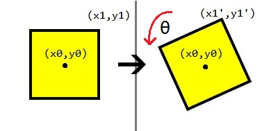

$$
\begin{cases} x_{1}' = [(x_{1}-x_{0})\cos\theta-(y_{1}-y_{0})\sin\theta] + x_{0} \\\\ y_{1}' = [(y_{1}-y_{0})\cos\theta+(x_{1}-x_{0})\sin\theta] + y_{0} \end{cases}
$$

把這個公式加入向量函式庫:
```js
// angle:弧度, refP:參考點
// 作用: 以refP為參考點，旋轉angle角
Vector.prototype.rotateRefPoint = function (angle, refP) {
    let new_x = (this.x - refP.x) * Math.cos(angle) - (this.y - refP.y) * Math.sin(angle) + refP.x;
    let new_y = (this.y - refP.y) * Math.cos(angle) + (this.x - refP.x) * Math.sin(angle) + refP.y;
    this.x = new_x;
    this.y = new_y;
}
```

然後讓我們來建立一個基本的物體:

先簡單寫出Box的結構
```js
function Box(x, y, w, h) {
    this.pos = new Vector(x, y);// 中心
    this.w = w;
    this.h = h;
    // 以順時針紀錄矩形的四個角
    this.corners = [
        new Vector(w / 2, -h / 2),
        new Vector(w / 2, h / 2),
        new Vector(-w / 2, h / 2),
        new Vector(-w / 2, -h / 2)
    ];
    // 假設角度是45
    this.directionAngle = toRadio(45);// 將45換成弧度

    this.getVertices = function () {
        var vertices = [];
        // 順時針走訪角落
        for (var i = 0; i < this.corners.length; i++) {
            var p1 = this.corners[i];

            var vec = new Vector(this.pos.x + p1.x, this.pos.y + p1.y);
            // 將各個角以物體中心為參考點來旋轉
            vec.rotateRefPoint(this.directionAngle, this.pos);

            vertices.push(vec);
        }
        // 最後回傳以物體中心為參考點選轉後的角落
        return vertices;
    }
}
```

接下來只要呼叫getVertices()就能取得**旋轉後**四個角的陣列了 :
```js
// 取得box1的4個角
var boxA_Vertices = boxA.getVertices();
```

第二步，參考"如何取得分離軸上的投影"的說明，取得box1在分離軸上的min、max投影。而box2也是一樣的方法 :
```js
// 假設分離軸為45度角
var axis = new Vector(1, -1);

// 取得box1的4個角
var boxA_Vertices = box1.getVertices();

// 先以第一個角當初始值
// vec.projectLengthOnto(axis) : 取得vec在axis上的投影長
var min_proj_boxA = boxA_Vertices[0].projectLengthOnto(axis);
var min_index_boxA = 0;

var max_proj_boxA = boxA_Vertices[0].projectLengthOnto(axis);
var max_index_boxA = 0;

// 再從剩下的3個角選出最大和最小投影
for (var i = 1; i < 4; i++) {
    var current = boxA_Vertices[i].projectLengthOnto(axis);

    // 選擇最小投影
    if (current < min) {
        min_proj_boxA = current;
        min_index_boxA = i;
    }
    // 選擇最大投影
    if (current > max) {
        max_proj_boxA = current;
        max_index_boxA = i;
    }
}
```

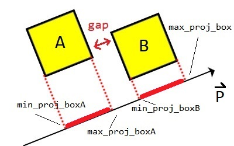

最後，當我們有了box1和box2的min、max後，就可以檢查他們是否在axis這個軸上碰撞
```js
if (min_proj_boxB > max_proj_boxA || min_proj_boxA > max_proj_boxB)
    Console.log("分離");// isSeparated
else
    Console.log("碰撞");// isCollided
```

讓我們把剛剛"第二步"的min、max取得整理一下，變成可呼叫的方法:
```js
// getMinMax(頂點陣列,分離軸)
function getMinMax(vertices, axis) {
    // 先以第一個角落投影為標準
    var min_DotProduct = vertices[0].projectLengthOnto(axis),
        max_DotProduct = vertices[0].projectLengthOnto(axis);

    for (var i = 1; i < vertices.length; i++) {
        // 取得當前要比對的投影長度
        var temp = vertices[i].projectLengthOnto(axis);
        // 如果比當前最小的更小，紀錄它
        if (temp < min_DotProduct) {
            min_DotProduct = temp;
            min_index = i;
        }
        // 如果比當前最小的更大，紀錄它
        if (temp > max_DotProduct) {
            max_DotProduct = temp;
            max_index = i;
        }
    }

    var result = {
        min: min_DotProduct,
        max: max_DotProduct
    };
    // 最後傳回一個物件包含min、max屬性
    return result;
}
```


## 7. 如何取得分離軸?

在SAT介紹的時候也提到，兩物體間有無限多條分離軸，難不成要真的從0度~360度的分離軸全部投影一變嗎?

其實不需要，我們只需要沿著物體所有邊上的**法向量當作分離軸**作檢查，即可判斷。

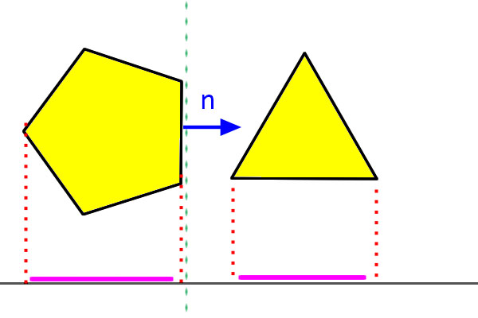

由上圖可知，如果我們將三角形向左平移，直到與五角形投影重疊時，代表他們發生碰撞。

而綠色那條分離線，可以當作五角形守備的領域，只要有東西進到這裡，就代表碰撞。

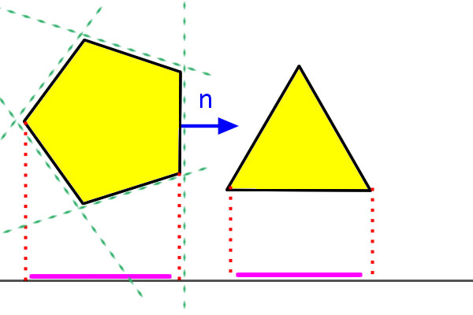

如上圖，將五角形每個邊上的檢查線都畫出來後，只要取跟檢查線垂直的軸，就是我們需要的分離軸。

**只要有任何物體進入綠色分離線的包圍區，就代表物體與五角形發生碰撞**。

<br>

那麼要如何取得邊上的法向量?

這時候就是補充知識1-法向量派上用場的時候了。

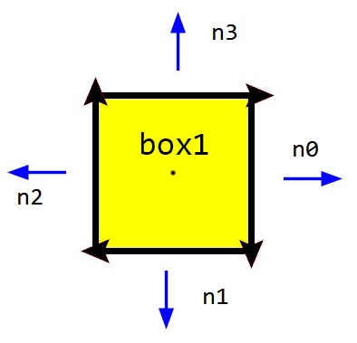

如上圖，對每個邊向量取法向量即可，而我這邊以順時針、取左法向量為例子。

可以發現，在矩形中會有兩組方向相反的法向量，所以可以透過優化找出重複的法向量增加效率，但通常只對矩形有效果。

先讓讓我們在Box物件中再加入getNorms()這個方法 :
```js
function Box(x, y, w, h) {
    // ...省略...
    this.getNorms = function () {        
        var vertices = this.getVertices();// 取得頂點
        var norms = [];
        var p1, p2, n;

        // 順時鐘
        for (let i = 1; i < vertices.length; i++) {
            p1 = vertices[i - 1]; 
            p2 = vertices[i];
            // 取得這個邊的左法向量
            n = new Vector(p2.x - p1.x, p2.y - p1.y).normalL();
            // 加入這個法向量
            norms.push(n);
        }
        // 補上最後一個邊
        p1 = vertices[vertices.length - 1];
        p2 = vertices[0];
        n = new Vector(p2.x - p1.x, p2.y - p1.y).normalL();
        norms.push(n);
        // 最後傳回這個物體所有邊上的左法向量
        return norms;
    }
}
```

有了頂點取得的方式、投影大小的判斷加上邊上法向量的取得，我相信你已經有足夠的知識來完成SAT碰撞檢測了。


## 8. 粗糙的矩形檢測

讓我們來看看針對矩形的程式碼，這段程式碼單純是了解檢查過程，如果你對判斷的方法不是很清楚的話希望你花一些時間看一下，後面會在寫出一個整理過的寫法。

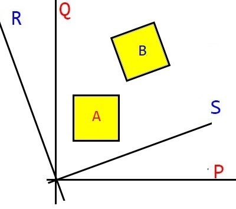

這裡我假設A方塊的法向量是P、Q，B方塊的法向量是S、R，手動對它們一一檢查

```js
function SAT_Collision(boxA, boxB) {
    var vertices_boxA = boxA.getVertices();
    var vertices_boxB = boxB.getVertices();
    var norms_boxA = boxA.getNorm();
    var norms_boxB = boxB.getNorm();

    // 假設boxA的法向量為P、Q，boxB為R、S
    // boxA、boxB在P、Q檢查軸上的投影
    var MinMax_PA = getMinMax(vertices_boxA, norms_boxA[0]);
    var MinMax_PB = getMinMax(vertices_boxB, norms_boxA[0]); 
    var MinMax_QA = getMinMax(vertices_boxA, norms_boxA[1]);
    var MinMax_QB = getMinMax(vertices_boxB, norms_boxA[1]);

    // boxA、boxB在R、S檢查軸上的投影
    var MinMax_RA = getMinMax(vertices_boxA, norms_boxB[0]);
    var MinMax_RB = getMinMax(vertices_boxB, norms_boxB[0]); 
    var MinMax_SA = getMinMax(vertices_boxA, norms_boxB[1]);
    var MinMax_SB = getMinMax(vertices_boxB, norms_boxB[1]);
    
    // 在分離軸上是否分離
    var separate_P = MinMax_PB.min_proj > MinMax_PA.max_proj ||
                     MinMax_PA.min_proj > MinMax_PB.max_proj;
    var separate_Q = MinMax_QB.min_proj > MinMax_QA.max_proj ||
                     MinMax_QA.min_proj > MinMax_QB.max_proj;
    var separate_R = MinMax_RB.min_proj > MinMax_RA.max_proj ||
                     MinMax_RA.min_proj > MinMax_RB.max_proj;
    var separate_S = MinMax_SB.min_proj > MinMax_SA.max_proj ||
                     MinMax_SA.min_proj > MinMax_SB.max_proj;

    var isSeparated = separate_P || separate_Q || separate_R || separate_S;
    if(isSeparated)
        Console.log("分離");// isSeparated
    else
        Console.log("碰撞");// isCollided
}
```

測試結果:

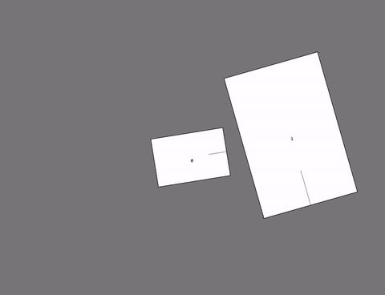

但上面那個只適用在矩形上，而且Code又醜又長，所以把它整理一下。


## 9. 編寫程式碼–多邊形與多邊形

雖然這裡的寫法也還是沒有完全優化，其實你可以將normal_polygonA、B合併後在一起走訪，但我想範例這樣比較容易了解。
```js
// true:兩物體分離, false:兩物體碰撞
function SAT_Collision(polygonA, polygonB) {
    // 取得多邊形每個邊上的法向量，回傳陣列
    var normal_polygonA = polygonA.getNorm(),
        normal_polygonB = polygonB.getNorm();
    // 取得多邊形的頂點陣列，回傳陣列
    var vertices_polygonA = polygonA.getVertices(),
        vertices_polygonB = polygonB.getVertices();

    var isSeparated = false;

    // 透過迴圈走訪多邊形A的法向量，來檢查是否分離
    for (var i = 0; i < normal_polygonA.length; i++) {
        var minMax_A = getMinMax(vertices_polygonA, normal_polygonA[i]);
        var minMax_B = getMinMax(vertices_polygonB, normal_polygonA[i]);

        isSeparated = (minMax_B.min > minMax_A.max || minMax_A.min > minMax_B.max);
        // 只要發現有一條分離線，就代表物體沒有發生碰撞
        if (isSeparated) return true;
    }

    // 透過迴圈走訪多邊形B的法向量，來檢查是否分離
    for (let i = 0; i < normal_polygonB.length; i++) {
        var minMax_A = getMinMax(vertices_polygonA, normal_polygonB[i]);
        var minMax_B = getMinMax(vertices_polygonB, normal_polygonB[i]);

        isSeparated = (minMax_B.min > minMax_A.max || minMax_A.min > minMax_B.max);
        if (isSeparated) return true;
    }
    // 如果所有法向量都檢查過後，沒有發現分離，代表兩物體碰撞
    return false;
}
```

由Code可以看到，**只要物體間有分離，就可以跳出並回傳結果**，不需要再去檢查B的法向量。

要注意這邊的isSeparated在分離時為Ture、碰撞時為False，如果你要以碰撞作檢查的話**記得加上NOT**。

使用範例:
```js
function update(dt) {
    polygonA.update(dt);
    polygonB.update(dt);

    var isCollided = !SAT_Collision(polygonA, polygonB);
    if(isCollided){
        // ...發生碰撞後要做的事...
    }
}
```

測試結果:

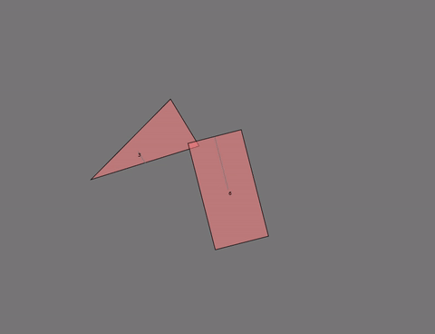


原始碼在最後。

## 10. 編寫程式碼–多邊形與圓

已經完成範例，但還沒編寫文章

假設今天是N多邊形與圓形，大致的做法就是，一樣取得多邊形的法向量做分離軸檢測，然後最後再多補上一條分離軸，為圓心到多邊形最近的頂點，這樣就能正確的判斷圓形。

## 11. SAT的總結

關於SAT的優缺點:
1. SAT的方法是些假設兩物體是分離的，並在檢查中只要成功找到正確的分離軸，就直接跳出，所以當物體都是分離狀態時，SAT的效率是非常高的。
2. 只要物體之間有碰撞，SAT就必須檢查所有的法向量，來確保物體之間沒有分離線，越多的物體發生碰撞，效率也就越低。
3. 因為SAT是採用所有法向量來作檢測，當多邊形的邊越多時，效率也會越來越低，但可以透過找出正負相反的法向量來減少檢查次數。
4. SAT雖然無法檢查凹多邊形，但是能透過將多個凸多邊形組合成凹多邊形的形狀，來作碰撞檢測。
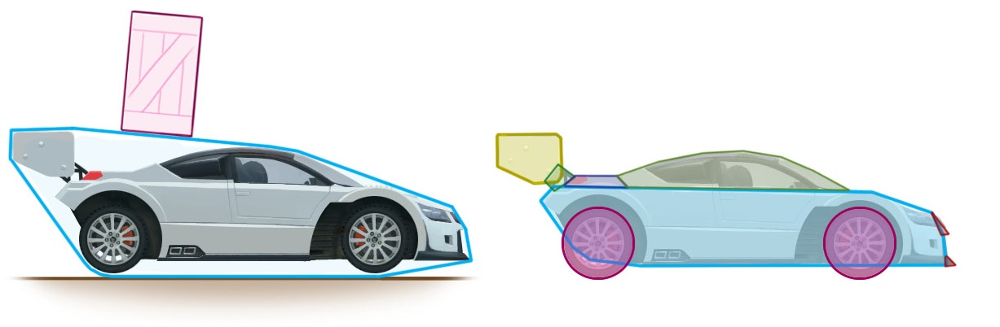
5. SAT在運算時能夠取得碰撞物體間的**最小穿透量**(MTV, Minimum translation vector)，所以能夠處理物體間的**碰撞回饋**，並進一步地達成剛體動力學的模擬。
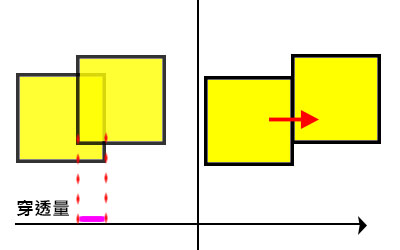


所以SAT碰撞在做過效能調整後，是很好的碰撞檢測演算法，靈活度也很高，是很多物理引擎會採用的檢測法之一。

還有另一個凸邊形的高效演算法GJK以疊代地生成單形以對兩個凸集求閔可夫斯基和，有興趣可以研究看看。

如果對碰撞方法有興趣的話可以參考這篇:

Bullet physics engin軟體工程師-*Erwin Coumans* : [Collision Detection for Real-Time Simulation](https://web.archive.org/web/20210120035950/http://www.continuousphysics.com/ftp/pub/test/files/physics/papers/hcts1999-ERIC-collisions.pdf)

其他相關資源:
- [SAT (Separating Axis Theorem)](https://web.archive.org/web/20210120035950/http://www.dyn4j.org/2010/01/sat/#sat-top)
- [2D Collision Detection](https://web.archive.org/web/20210120035950/http://wiki.roblox.com/index.php?title=2D_Collision_Detection#Method_2:_Separating_axis_theorem_.28SAT.29)
- [2D polygon-based collision detection and response](https://web.archive.org/web/20210120035950/http://elancev.name/oliver/2D%20polygon.htm#tut2)
- [Video Game Physics Tutorial](https://web.archive.org/web/20210120035950/https://www.toptal.com/game/video-game-physics-part-ii-collision-detection-for-solid-objects)


## 12. 多物體的碰撞優化

當我們要檢查多個物體碰撞時，通常會直接對所有物體互相進行判斷，就像下面這段Code:

基本枚舉法的Code:
```js
// shapes是指所有的物體陣列
function update(dt) {
    // ...更新物體狀態...
    for (var i = 0; i < shapes.length; i++) {
        for (var j = 0; j < shapes.length; j++) {
			// 如果是同個物體就跳過
            if (i == j) continue;

            var isCollided = !SAT_Collision(shapes[i], shapes[j]);
            if(isCollided){
                // ...碰撞事件...
            }            
        }
    }    
}
```

用這種最直觀的方式檢查，時間複雜度會達到O(n!)，當場景複雜，需要檢測的物體變多後，用枚舉的方式檢測可能會導致遊戲延遲。

其中最大的問題就是，當場景中有兩個距離非常遠的物體，遠到根本不可能發生碰撞，卻照樣對他們進行檢測，導致效能的浪費。


### 簡單的介紹一個優化方法 – AABB Tree :

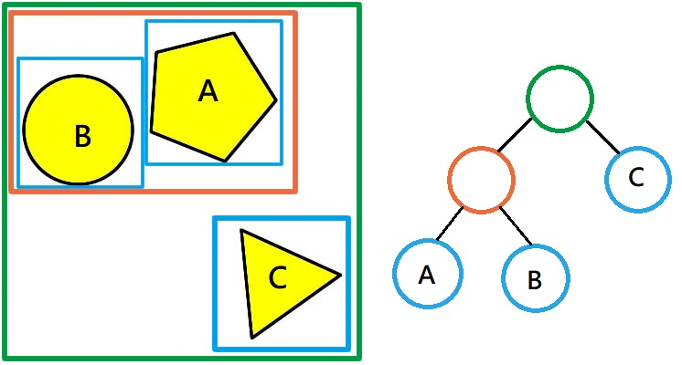

建立ABT的方法跟建立二元樹的方法一樣，來看執行步驟:

- Step1. 把A加入樹中，作為根結點。
- Step2. 把B加入樹中，判斷是否與根結點A有碰撞，如果有的話就在繼續比較子節點，如果都沒有與子節點有碰撞，就把B加入子節點後，如果與節點都沒有碰撞的話，就把A、B當作一個新區域，並生成A、B的父節點(橘色圈圈)。
- Step3. 把C加入樹中，方法跟Step2一樣，最後得到上圖中的樹。

假如我要檢查A物體時，只需要檢查同在橘色區域的B物體即可。


AABB Tree在建立時，就先把有機會碰撞的放在同一區，有了這樣的結構後，要判斷碰撞的效率就提高了，因為只需判斷與該物體同區域的物體即可，並不需要全部檢查，使得時間複雜度縮減到O(log n)。

而其他多物體碰撞的演算法還有:<br>
四叉樹(Quad Trees)、八叉樹(octree)、二元分割樹(BSP tree)、kd樹、球體樹(sphere tree)、R樹(R tree)、碰撞投影、光線投影等等…，有興趣的可以在自己研究。


## 13. 動態物體間的碰撞檢測

這裡為大家提供一些解決的方向，我目前知道有這種解決方法，但礙於能力不足，只研究到觀念部分。


在我們前面講的碰撞檢測方法都只適用在靜態，什麼意思呢?

在遊戲中做的碰撞檢測其實是以離散時間來模擬，因此在每個瞬間，物體的位置和方向是靜止的，就像快照一樣，若物體的移動速度與其相對尺寸來說不是太快的話，這種方法是可行的，事實上在許多物理引擎中，都是使用這種方法。

但對於較小且高速的移動物體，這種方法就會失效，想像現在有個很小的物體，他每次更新時的移動幅度大於碰撞體的尺寸，就會發生「穿隧」的問題。

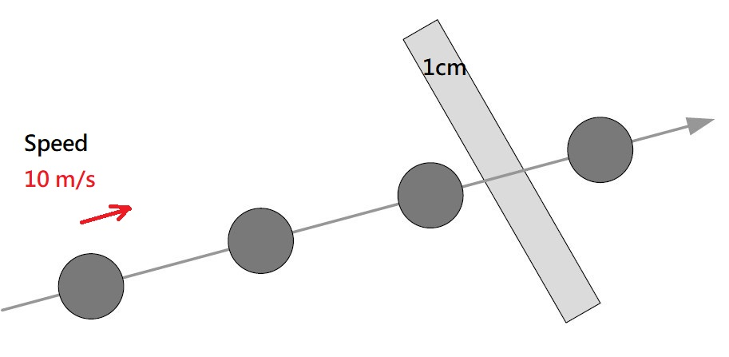

解決方法

掃描形狀(swept shape):

對一個物體的位置、速率與加速度取線性穿插，得到一個時間段的物體快照，再透過掃描的形狀做檢測。

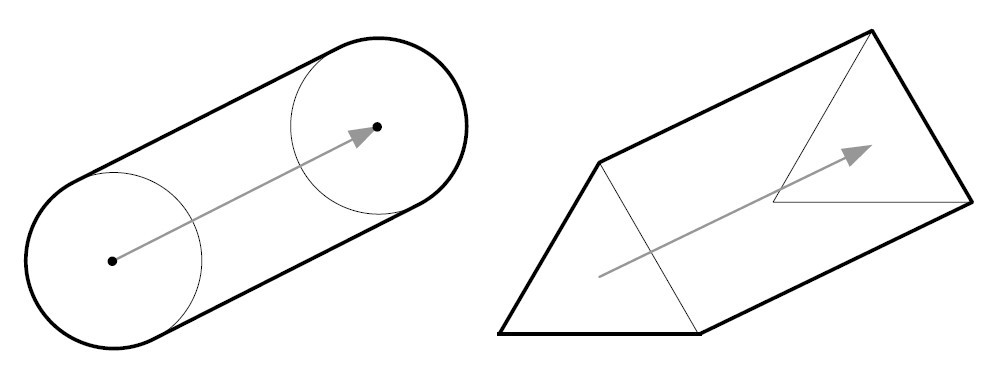
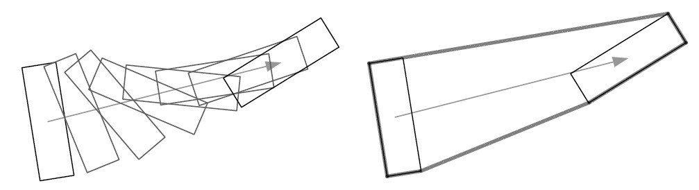

形狀掃描對動態物體來說，是一個有效的檢測技術，能保證不錯過快照之間的碰撞。

缺點是，若物體的行進路線為曲線甚至旋轉，僅透過線性穿插計算，其結果是不準確的，所以要再根據狀況使用更精準的技術。

其實還有很多更好的解決方案，有興趣的可以在自己研究。


## 14. Source Code


執行範例:

我的SAT碰撞執行範例 : <a class="link" href="/downloads/Collision-SAT/ver0.2.1-polygon-merge/" target="_blank" rel="noopener">ver0.2.1-polygon-merge</a>

Source Code:
- 文章中的範例Source Code: [https://github.com/md9830415/Collision-Detection-article](https://github.com/md9830415/Collision-Detection-article)
- 自製的向量函式庫 : [https://github.com/md9830415/JS-Vector2D](https://github.com/md9830415/JS-Vector2D)
- SAT碰撞檢測 Code: [https://github.com/beadx6ggwp/Collision-SAT](https://github.com/beadx6ggwp/Collision-SAT)


額外應用:
- 最小位移量MTV Code: [https://github.com/beadx6ggwp/Collision-MTV](https://github.com/beadx6ggwp/Collision-MTV)


## 15. 結尾感想

那麼為什麼要對碰撞這麼刁鑽，就是為了能模擬物理效果，當碰撞的處理達到一定的程度後，就可以邁向下一個階段「剛體動力學」與「物理模擬」，讓電腦中的物體越來越接近現實，有趣吧。

光是碰撞的處理就有這麼多複雜的技術問題，就可以了解高階遊戲開發工程師是多麼厲害的一群人了。

為了做出更好的遊戲，還要很多東西要學，為了能有效的使用電腦資源，要學會作業系統架構、演算法、資料結構並精通程式語言，要能在螢幕中顯示各種效果、視角操控，還要學習電腦圖學、線性代數，為了處理物理模擬，還要學習古典物理、高等微積分，而這些東西到了三維空間後，又更加複雜，還有專案管理等等附加技能，加上遊戲工程師們也不斷的在進化，搞不好一輩子都學不完呢。

---

終於寫完了，這篇文中我嘗試用各種插圖來解釋一些觀念，不知不覺就打了這麼多，我Coding技巧很差，範例執行的效率可能沒有很好，但我想對這篇文想表達的內容影響不大。

最後，感謝你的觀看，希望你在閱讀後能有些收穫。

對這文章有任何問題，歡迎在下方留言提出意見，或是E-mail與我聯絡davidmd9830415@gmail.com。

大概就是這樣了，掰掰。

---

首次發表時間 : 2017/8 高二升三暑假準備工科賽時製作


## 參考資源:

- Game Engine Architecture, Second Edition.pdf : [here](http://www.gameenginebook.com/)
- Video Game Physics Tutorial : [here](https://www.toptal.com/game/video-game-physics-part-ii-collision-detection-for-solid-objects)
- Collision Detection for Real-Time Simulation : [here](http://www.continuousphysics.com/ftp/pub/test/files/physics/papers/hcts1999-ERIC-collisions.pdf)
- Collision Detection – contact generation and GPU acceleration : [here](http://sglab.kaist.ac.kr/~sungeui/Collision_tutorial/Erwin.pdf)
- Physics – Collision in 2 dimensions : [here](http://www.euclideanspace.com/physics/dynamics/collision/twod/)
- Collision Detection Using the Separating Axis Theorem : [here](https://gamedevelopment.tutsplus.com/tutorials/collision-detection-using-the-separating-axis-theorem--gamedev-169)
- SAT (Separating Axis Theorem) : [here](http://www.dyn4j.org/2010/01/sat/)
- 2D Collision Detection : [here](http://wiki.roblox.com/index.php?title=2D_Collision_Detection#Method_2:_Separating_axis_theorem_.28SAT.29)
- 2D polygon-based collision detection and response : [here](http://elancev.name/oliver/2D%20polygon.htm)
- Collision detection : [here](https://learnopengl.com/#!In-Practice/2D-Game/Collisions/Collision-detection)
- Collision resolution : [here](https://learnopengl.com/#!In-Practice/2D-Game/Collisions/Collision-resolution)
- Introductory Guide to AABB Tree Collision Detection : [here](http://www.azurefromthetrenches.com/introductory-guide-to-aabb-tree-collision-detection/)
- How to Create a Custom Physics Engine : [here](https://gamedevelopment.tutsplus.com/series/how-to-create-a-custom-physics-engine--gamedev-12715)
- Vector maths – a primer for games programmers : [here](https://wildbunny.co.uk/vector-maths-a-primer-for-games-programmers/)
- 平面上基本的線性變換：旋轉、鏡射、伸縮、推移 : [here](http://highscope.ch.ntu.edu.tw/wordpress/?p=51374)
- 二階方陣表示的線性變換 : [here](http://math1.ck.tp.edu.tw/%E9%99%B3%E5%98%AF%E8%99%8E/%E5%B0%8F%E8%99%8E/99%E8%AA%B2%E7%B6%B1/%E7%AC%AC%E5%9B%9B%E5%86%8A/%E9%87%8D%E9%BB%9E/99%E8%AA%B2%E7%B6%B1%E6%95%99%E5%AD%B8%E9%87%8D%E9%BB%9E%E6%95%B4%E7%90%864-3-4%E7%9F%A9%E9%99%A3-%E4%BA%8C%E9%9A%8E%E6%96%B9%E9%99%A3%E8%A1%A8%E7%A4%BA%E7%9A%84%E7%B7%9A%E6%80%A7%E8%AE%8A%E6%8F%9B.pdf)
- AABB包围盒算法,在2D碰撞检测中的实现 : [here](https://segmentfault.com/a/1190000006802081)
- “等一下，我碰！”——常见的2D碰撞检测 : [here](https://github.com/JChehe/blog/issues/8)
- Core HTML5 Canvas: Graphics, Animation, and Game Development