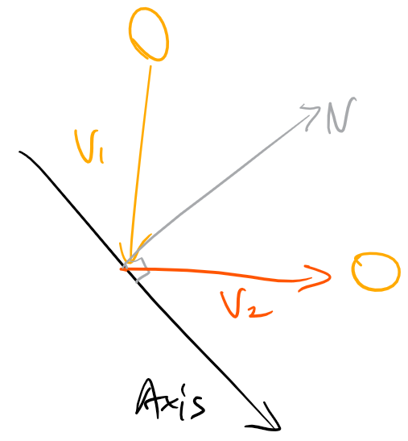
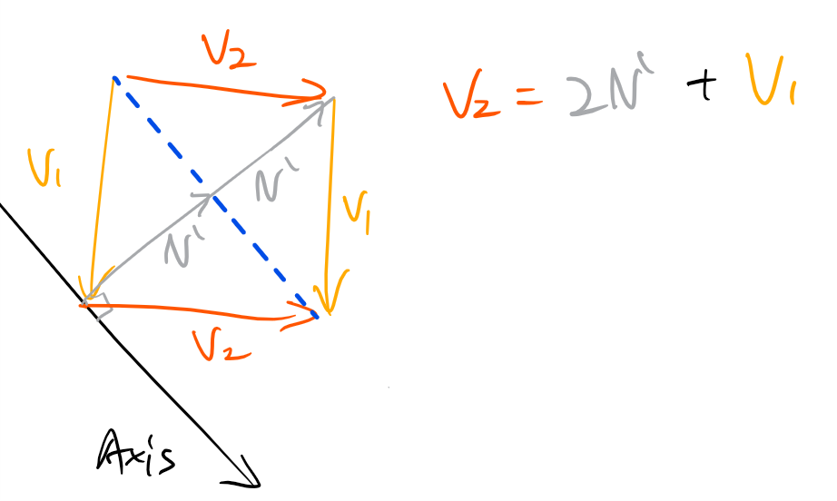
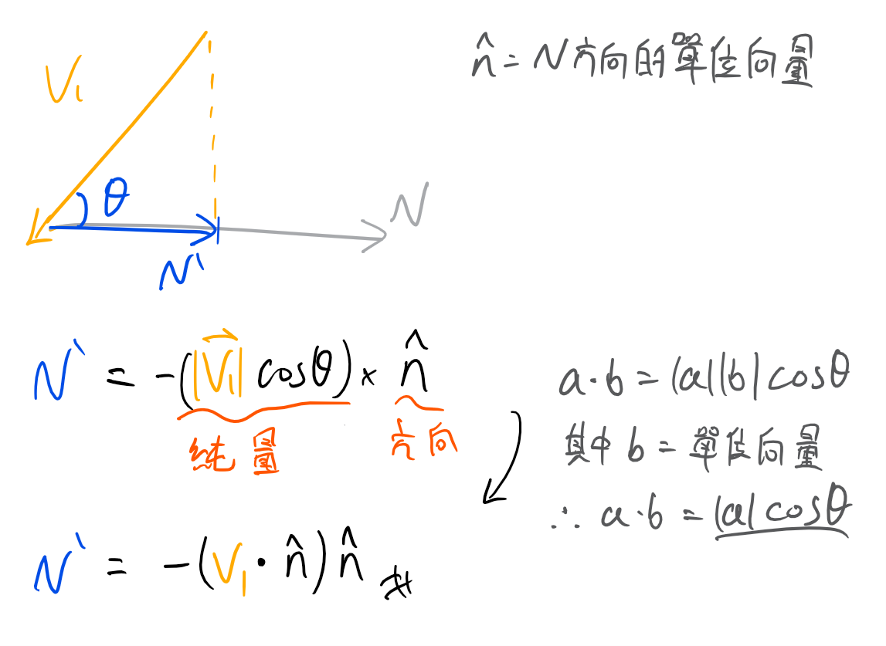

# Vector Reflection

這篇文應該是要跟MTV(Minimum Translation Vector)的碰撞回饋一起寫，但MTV發起來有點長，懶得打，先記錄Vector Reflection

## 為什麼需要取得鏡射向量(Vector reflection)

一個簡單的例子，當乒乓球擊中球拍時，要如何取得反彈後的向量，而光影模擬時也會需要取得光線反射的向量，這時向量反射就非常重要了。

因為這篇內容比較基礎，所以一些基本部份就省略了

## 如何取得Vector reflection

先定義一些資訊:

- V1 = 物體的速度
- V2 = 物體反彈後的速度
- N = 擊中平面的法向量

如何取得擊中平面的法向量 N 呢?

很簡單，透過兩垂直向量點積為0的特性就可以得到，假設Axis是(3, 4)的向量，那平面法向量就會是(-y, x) = (-4, 3) 或是 (y, -x) = (4, -3)

再來看如何取得 V2

將V1與V2之間畫一條線，並組合成一個平行四邊形，這樣就很明顯得到 V2 = 2N' + V1，那麼接下來的問題就會是如何取得N'。

先只單看V1跟法向量N，可以發現N' 其實就是V1在法向量N上面的投影$proj_{\hat n}V_{1}$，所以可以透過基本三角函數來取得

但$\cos \theta$需要另外計算夾角，所以有個更好的方法來代替，在點積公式中，使其中一個向量為單位向量，因為長度為1可直接省略，所以$\left |V_{1}  \right | \cos \theta = V_{1} \cdot \hat{n}$，要加負號是因為$V1$與$\hat{n}$為反方向，$\left |V_{1}  \right | \cos \theta$會是帶負號的純量，但我們需要的$\hat{n}$是與$V_{1}$反向的，所以加上負號:

而$(V_{1} \cdot \hat{n})\hat{n}$就是快速求得$V_{1}$在法向量$\hat{n}$投影的方式:
$$proj_{\hat n}V_{1}=(V_{1} \cdot \hat{n})\hat{n}$$

再來回到$V_{2} = 2N' + V_{1}$

該有的東西都有了，所以整理後可以得到:

$$V_{2} = V_{1} - 2(V_{1} \cdot \hat{n})\hat{n}$$

- V1 = 物體方向
- n = 擊中平面的"單位"法向量
- v2 = 反彈後的方向

接者就可以放在當物體與某個平面碰撞後，更新反彈後的速率為V2，就會有乒乓球反彈的效果了

大概就這樣，具體結果可以參考:[從零開始的基礎RPG框架](https://davidhsu666.com/archives/2dgame-nonename/)

## 參考資料

- [Basic Ad Hoc Collision Response](http://www.icodeguru.com/VC&MFC/TricksofWinGameProgrammingGurus2ed/0672323699_ch13lev1sec5.html)
- [3D Programming Weekly:Graphics:Reflecting a Vector](http://www.3dkingdoms.com/weekly/weekly.php?a=2)
- [How to get reflection vector?](https://bocilmania.com/2018/04/21/how-to-get-reflection-vector/)