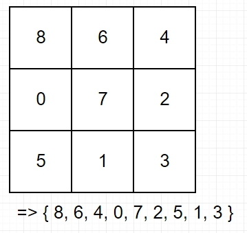
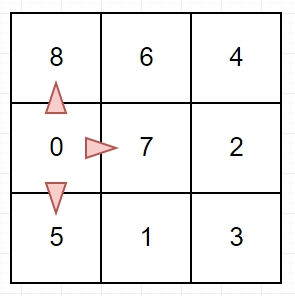
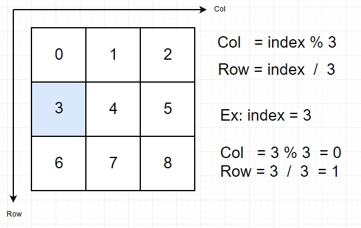
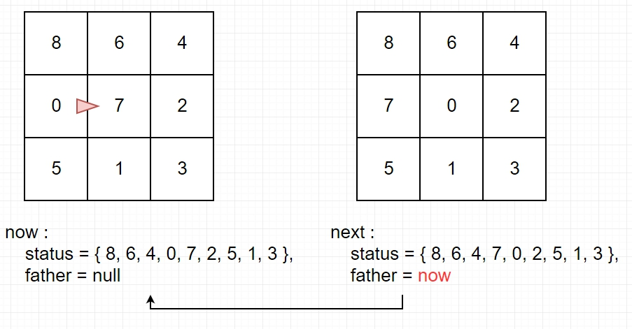
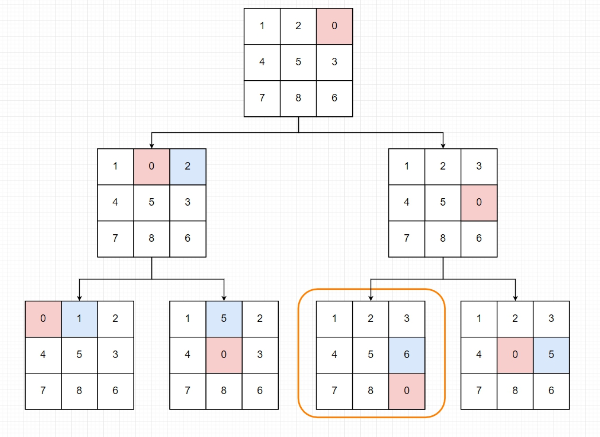
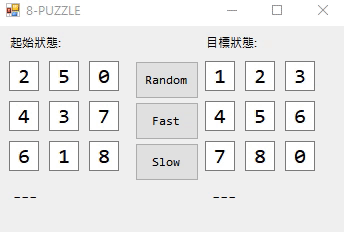

 

## 1. 前言

先來簡單的介紹一下什麼是8-Puzzle。

數字推盤遊戲(n-puzzle)是最早一種的滑塊類遊戲，常見的類型有十五數字推盤遊戲和八數字推盤遊戲等，也有以圖畫代替數字的推盤遊戲。


如上圖所示，滑塊只能往空位移動。

大概了解遊玩方法後，就來試著解決8-Puzzle問題吧!

 

解法的步驟大概是這樣 :

1. 先完成移動判斷和節點狀態的儲存結構
2. 用BFS窮舉狀態，並把當前狀態記錄下來篩選重複路徑
3. 只要有一組路徑符合結果，該路徑就是最佳解(因BFS的特性是每次平均向外擴展，所以最先碰到終點的就是最佳解之一)
4. 否則搜尋完畢後皆沒有找到符合的狀態，無解
5. 最後透過父節點的回溯取得輸出路徑，即可得到最短路徑和分解步驟


## 2. 儲存結構和移動判斷

首先是儲存狀態，用二維陣列來儲存比較直觀，但是用一維陣列來儲存的話，我覺得在一些處理上比較方便，所以我採用一維陣列。



像是上面的這個狀態這樣，將0表示為空格，可以儲存成 { 8, 6, 4, 0, 7, 2, 5, 1, 3}。

因為要透過BFS搜尋來取得路徑，所以需要建立一個節點的結構，這樣才能儲存當前狀態，並紀錄上個狀態 :

```C#
public class Node
{
    public byte[] status; // 當前狀態
    public Node father; // 紀錄上個狀態，如果father = null 該點為根節點
    public Node(byte[] status, Node father)
    {
        this.status = status;
        this.father = father;
    }

    // 把陣列轉換成數字序列，比對時就不用兩將陣列元素一一檢查了
    // 像是 stauts = {8, 6, 4, 0, 7, 2, 5, 1, 3}，轉後後即可得到864072513
    public int ToToSequence()
    {
        int result = 0;
        for (int i = 0; i < status.Length; i++)
            result = result * 10 + status[i];
        return result;
    }
}
```

再來是移動判斷，滑塊在移動時，可以看成是空白方塊在移動。



如上圖，0 可以往上、右、下移動，但是不能往左，那麼要如何判斷0能往哪個方向走呢?



如上圖，當 index = 3 時，可以得知在二維時座標是 (0, 1)。

能取得對應位置後，就能夠寫出移動判斷，像是當空位在最左邊時Col = 0，那麼就不能往左走，因為在最左邊了，在最下面時Row = 2，不能往下走，因為已經到底了。

所以可以得出:

- Col != 0，可以往左走
- Col != 2，可以往右走
- Row != 0，可以往上走
- Row != 2，可以往下走

但是只有判斷能不能走還不夠，因為當空格移動時，必須跟那個位置的數字交換，並記錄下原本的狀態 :
```C#
List<Node> GetNext(Node now)// 傳入當前版面，回傳0所有移動後的狀態
{
    int index = Array.IndexOf<byte>(now.status, 0);
    int col = index % 3;
    int row = index / 3;

    List<Node> nextPush = new List<Node>();
    byte[] next;

    if (row != 0) // Top
    {
        next = (byte[])now.status.Clone();        
        swap(ref next[index], ref next[index - 3]);// 跟上面交換        
        nextPush.Add(new Node(next, now));// 加入這個新狀態
    }

    if (col != 2) // Right
    {
        next = (byte[])now.status.Clone();        
        swap(ref next[index], ref next[index + 1]);// 跟右邊交換
        nextPush.Add(new Node(next, now));
    }

    if (row != 2) // Bottom
    {
        next = (byte[])now.status.Clone();        
        swap(ref next[index], ref next[index + 3]);// 跟下面交換
        nextPush.Add(new Node(next, now));
    }

    if (col != 0) // Left
    {
        next = (byte[])now.status.Clone();        
        swap(ref next[index], ref next[index - 1]);// 跟左邊交換
        nextPush.Add(new Node(next, now));
    }
    return nextPush;
}
```

在交換前要先複製一份，因為陣列參數是傳參考，直接交換會修改到原本的狀態，所以要先Clone後再傳給新狀態做交換。

而上面程式碼中 new Node(next, now)，意思是建立一個新節點next，而他的前一個狀態是剛剛傳進來的now。



如上圖，假設now是根結點，而next是下個節點，那麼new Node(next, now)後就會像這樣。

## 3. 用BFS窮舉狀態

有了移動判段後，接下來的解法就跟用BFS解迷宮差不多了 :
```C#
// 傳入原本的版面和目標版面，回傳最短路徑
List<Node> Solve(byte[] source, byte[] goal)
{
    Queue<Node> queue = new Queue<Node>();

    // 使用狀態序列來儲存已走過的路徑，防止往回走
    SortedList<int, bool> book = new SortedList<int, bool>();

    Node end = new Node(goal, null);// 終點
    Node start = new Node(source, null);// 起點

    queue.Enqueue(start);// 推入起點
    book.Add(start.ToSequence(), true);// 標示起點已走過，防止走回頭路

    int endStatus = end.ToSequence();
    while (queue.Count > 0)
    {
        // 取得當前搜索狀態，並移出佇列
        Node now = queue.Dequeue();

        // 如果抵達終點，那就輸出路徑
        if (now.ToSequence() == endStatus)
            return PathTrace(now);

        // 取得能走的位置
        List<Node> nextPath = GetNext(now);                                
        foreach (var path in nextPath)
        {
            int sign = path.ToSequence();

            // 判斷當前節點狀態是否擴展過了
            if (!book.Keys.Contains(sign))
            {
                // 推入當前狀態，並標記該路徑已走過，因為每個狀態只需要擴展一次就夠了                
                queue.Enqueue(path);
                book.Add(sign, true);
            }
        }
    }

    // 如果窮舉完都沒找到，代表無解
    return null;
}

List<Node> PathTrace(Node now)
{
    // 回朔路徑
    List<Node> path = new List<Node>();
    while (now.father != null)
    {
        path.Add(now);
        now = now.father;
    }
    path.Reverse();
    return path;
}
```

路徑的儲存使用SortedList而不是正常的List，因為List在加入物件時並不會特別處理，所以在搜尋時就只能慢慢比較，而 SortedList的結構類似二元搜尋樹，在新增資料時就會依照設定的Key值做排序後再插入，所以在搜尋時的複雜度就能夠降到O(log2 n)，想了解更多的話請看最後的參考資源。

到這邊大概就能了解為什麼要用ToSequence()來儲存路徑了，因為資料不會重複，所以搭配SortedList就比List快的多。

使用方法:
```C#
byte[] source = new byte[] { 8, 6, 4, 0, 7, 2, 5, 1, 3 };
byte[] goal = new byte[] { 1, 2, 3, 4, 5, 6, 7, 8, 0 };

List<Node> path = Solve(source, goal);

Console.WriteLine($"最少步驟為:{path.Count}");
```

給定原本面狀態跟輸出狀態，即可得到最短路徑的List，而輸出路徑只要走訪一遍Path即可得到。

其實執行的原理很簡單，就是一直窮舉所有狀態，直到符合結果為止



## 4. 執行結果



Source Code : [Here](https://github.com/beadx6ggwp/Skills-Competition-Software/tree/master/101/101-5-OK)

雖然用BFS就能解了，但效率很差，之後會再研究看看A*演算法。


## 5. 參考資源

- What’s the difference between SortedList and SortedDictionary? : [here](https://stackoverflow.com/questions/935621/whats-the-difference-between-sortedlist-and-sorteddictionary)
- 各Collection陣列個別特性列表 : [here](https://dotblogs.com.tw/jeff-yeh/2009/12/07/12322)
- 8-Puzzle : [here](https://www.cs.princeton.edu/courses/archive/spr10/cos226/assignments/8puzzle.html)
- ACM 15-puzzle : [here](http://mudream.logdown.com/posts/256859/note-15-puzzle)
- Inndy GitHub : [here](https://github.com/Inndy)