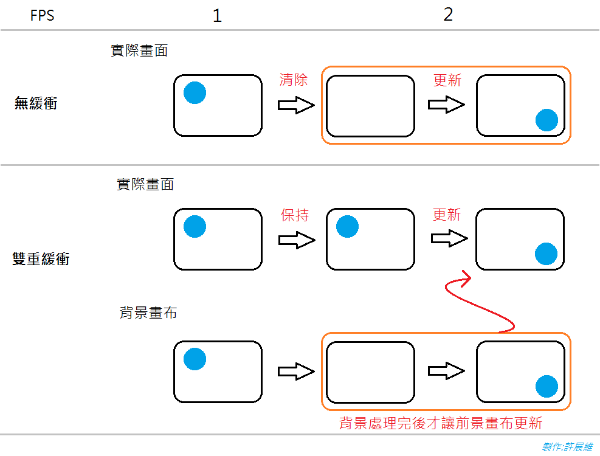

我在網路上搜尋到一些解決方法，在這裡做個整理。

正常更新畫面的方法都是先將畫面清空後，再將新的畫面畫上去，

導致清空的剎那，好像畫面閃爍了



解決方法:

1. 畫面重繪時，不直接在螢幕上重繪，而是先畫在緩衝區，等整個畫面都重繪完成，才一次放到螢幕上。
2. 想像我們用兩張紙來做更新，一張紙是當前畫面，另一張是緩衝區，在更新時把圖畫在第二章紙上，畫完後再一次把這張紙覆蓋到主畫面。

1.把DoubleBuffered 屬性設為 true。(參考自[C# MSDN使用表單和控制項的雙重緩衝](https://msdn.microsoft.com/zh-tw/library/3t7htc9c.aspx))
```C#
public Form1()
{
    InitializeComponent();
    this.DoubleBuffered = true;
}
```

2.使用 BufferedGraphicsContext 。(參考自[MSDN手動管理緩衝的圖形](https://msdn.microsoft.com/zh-tw/library/ka0yazs1.aspx))
```C#
float x = 0, y = 0;

public Form1()
{
   InitializeComponent();
   timer1.Interval = 1000 / 60;
   timer1.Start();
}
private void timer1_Tick(object sender, EventArgs e)
{
   x += 1;

   BufferedGraphicsContext currentContext = BufferedGraphicsManager.Current;
   BufferedGraphics myBuffer = currentContext.Allocate(this.CreateGraphics(), this.DisplayRectangle);

   //清除繪圖畫面，並用原本的背景色填充，否則背景呈現黑色
   myBuffer.Graphics.Clear(this.BackColor);

   //在圖形緩衝區中畫圖
   myBuffer.Graphics.DrawEllipse(Pens.Blue, x, y, 70, 70);

   //將圖形緩衝區的內容畫到指定的畫布上
   myBuffer.Render(this.CreateGraphics());

   //釋放緩衝區的資源
   myBuffer.Dispose();
   this.Refresh();
   this.Invalidate();
}
```

3.使用Bitmap。(參考自[Gary Lin 的 C# 遊戲程式設計](https://www.youtube.com/user/garfgary))

較推薦使用這種方式
```C#
float x = 0, y = 0;
Graphics backGraphics;
Bitmap backBmp;
public Form1()
{
   InitializeComponent();

   backBmp = new Bitmap(this.DisplayRectangle.Width
   , this.DisplayRectangle.Height);

   backGraphics = Graphics.FromImage(backBmp);

   timer1.Interval = 1000 / 60;
   timer1.Start();
}

private void timer1_Tick(object sender, EventArgs e)
{
   //清空畫面，否則前一次的畫面會保留在上面
   backGraphics.Clear(Color.White);
   x+=1;
   backGraphics.DrawEllipse(Pens.Blue, x, y, 50, 50);

   //將backBmp上的圖畫到Form上
   this.CreateGraphics().DrawImageUnscaled(backBmp, 0, 0);
}
```