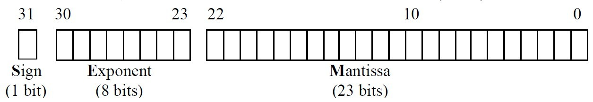

# 浮點數誤差IEEE-754

在程式語言中，浮點數基本都是用 float 與 double來表示，但都會存在誤差
```C++
float t1 = 0.69 * 10;
	
cout << setprecision(32) << t1 << endl;

if(t1 == 6.9)
    cout << "相等" << endl;
else 
    cout << "不相等" << endl;

// output
// => 6.900000095367431640625
// => 不相等
```

正常6.9 * 10 應該要等於6.9，但是答案卻是不相等?

這個原因跟浮點數的儲存原理有關，讓我們開始吧!


## 何謂IEEE-754

自電腦發明以來，曾出現過各種不同的浮點數表示法，但目前最通用的是IEEE二進制運算標準(IEEE Standard for Binary Floating-Point Arithmetic , 簡稱IEEE-754)

在IEEE-754標準中定義了四種浮點數格式，但我只講基本的兩種，分別為單精準度float(32bit)和雙精準度double(64bit)。其中單精準度有24位有效儲存數字，而雙精準則有53位有效數字，相對於十進位來說，分別是7位(2<sup>24</sup> = 10<sup>7</sup>)和16位(2<sup>53</sup> = 10<sup>16</sup>)。


為了方便說明，所以先解釋什麼是正規化

正規化就像是數學中的科學記號，如123456通常會表示成1.23456 x 10<sup>5</sup>，而指數部分也有可能是負的，如 0.123456 就會變成 1.23456 x 10<sup>-1</sup>。

二進位的正規化 :

這邊以13.125為例，先13轉換為2進制，可得1101，再將0.125轉為2進制

- 0.125 x 2 = 0.25 … 整數為0 -> 0
- 0.25 x 2 =0.5 … 整數為0 -> 0
- 0.5 x 2 = 1 … 整數為1 -> 1

所以13.125 = 1101.001，經過正規化後可得 1.101001 x 2<sup>3</sup>


在IEEE-754中，浮點數通常由三個部分組成 :

- 符號(S) : 用來表示正/負(0/1)。
- 指數(E) : 正規化後的次方數，採用超127格式，即將原本的次方數加上127，因為次方數有可能是負的，加上在電腦中要表示負號時，必須拿一個位元來表示，所以就將-128~+127改為0~255，所以基準點就從0變成127。
- 尾數(M) : 正規化後的小數點。

以下範例皆為單精準度 :



## 浮點數與10進制的轉換

以剛剛的 13.125 轉浮點數為例 :

1. 由於13.125為正，所以符號(S) = 0
2. 先將數值轉成二進位並正規化 13.125 = 1101.001 = 1.101001 x 2<sup>3</sup>
3. 計算指數(E) = 127 + 3 = 01111111 + 11 = 10000010
4. 計算尾數(M) = 101001，因為正規化後一定是1.xxxx，所以不需要儲存個位數
5. 將各個數值填入浮點數規格中<br>
S——–E———————M———————–<br>
0 10000010 101001 0000 0000 0000 0000 0

這樣就就完成了10進制轉IEEE-754浮點數

<br>

而浮點數轉10進制也是一樣

將剛剛的0 10000010 10100100000000000000000轉10進制 :

1. 由於S = 0，所以此數為正
2. 中間8位元的超127指數(E)為 10000010<sub>2</sub>，將其還原130 – 127 = 10000010<sub>2</sub> – 0111111<sub>2</sub> 可得 3 = 11<sub>2</sub>
所以要將尾數乘上2<sup>3</sup>
3. 最右邊23個為位元值為101001……，將隱藏的個位數還原，可得1.101001……
4. 最後將還原後的尾數乘上指數 1.101001<sub>2</sub> x 2<sup>3</sup>，並轉為10進位，即可得到 13.125


所以我們可以知道，以32bit的單精度浮點數來說，可以儲存的最大位數為 尾數 23+隱藏個位數 1 = 24位。


## 關於浮點數的精度

因為有些10進制小數無法完美的用2進制表示，只能用無限的位數來趨近於10進制小數，當我們以24位數為上限時，在儲存時就會省略一些位數，導致還原時的數字不夠精準。

從以下範例可以得知精確的數字總共7位數
```C++
#include <iostream> 
#include <iomanip>
using namespace std; 

int main()
{
	float t1 = 0.69 * 10;
 	cout << setprecision(32) << t1 << endl;
 	//output => 6.900000095367431640625
 	
 	float t2 = 0.1234567;
 	cout << setprecision(32) << t2 << endl;
 	//output => 0.12345670163631439208984375
 	
 	float t3 = 123.4567;
 	cout << setprecision(32) << t3 << endl;
 	//output => 123.45670318603515625
	
	float t4 = 16777216, t5=0.5;
	float t6 = t4 + t5;
 	cout << setprecision(32) << t6 << endl;
 	//output => 16777216
 	
 	return 0;
}
```


## 參考資源

- IEEE 浮點運算標準 : [here](http://math.ecnu.edu.cn/~jypan/Teaching/Cpp/doc/IEEE_float.pdf)
- C 語言取出/設定浮點數正規化欄位 : [here](https://goo.gl/3RpUZK)
- C/C++ 浮點數特殊值 : [here](https://goo.gl/mbWZoD)
- [C&C++] 浮點數精準度 (Floating-Point Precision) : [here](https://goo.gl/sjK8vR)
- IEEE-754 浮點數的表示法 : [here](http://jmiiv.blogspot.tw/2008/08/ieee-754.html)
- MSDN IEEE 浮點表示 : [here](https://msdn.microsoft.com/zh-tw/library/0b34tf65.aspx)
- Binary floating point and .NET : [here](http://csharpindepth.com/Articles/General/FloatingPoint.aspx)
- What Every Computer Scientist Should Know About Floating-Point Arithmetic : [here](http://docs.oracle.com/cd/E19957-01/806-3568/ncg_goldberg.html)
- C语言浮点型数据存储结构 : [here](https://blog.csdn.net/whzhaochao/article/details/12885875)
- IEEE754规范的舍入方案怎么理解呢？ : [here](https://www.zhihu.com/question/68131179)