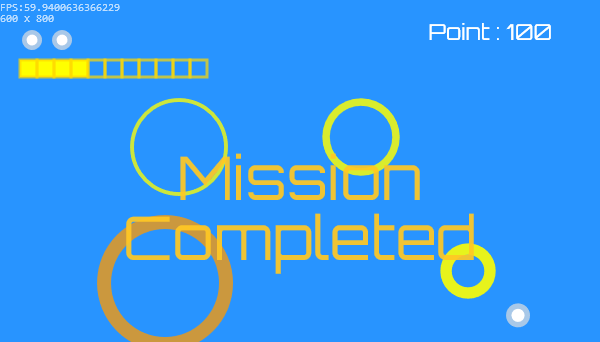
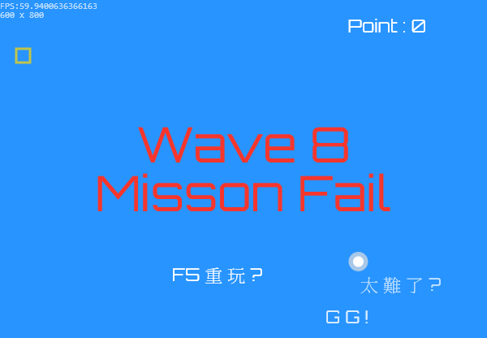
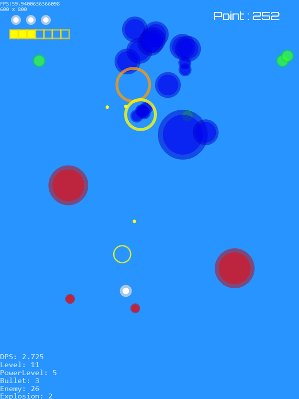

# JS 超級球球SuperBall

這小遊戲是我第一個破千行程式碼的專案，前前後後花了2個月左右，花了很多時間在想架構跟遊戲特效的呈現，到目前的進度算是有點成果，放到網站做個記錄。

## 遊戲連結

ver.0.2.3 : <a class="link" href="/downloads/Shooting Game Algorithm Maniax/project1 ver0.2.3" target="_blank" rel="noopener">Click Here</a>

source code : [Github](https://github.com/beadx6ggwp/js-superball)

## 遊玩方式

移動 : 鍵盤上下左右

攻擊 : 自動攻擊

目標 : **通過 8 關**

敵人
- 藍球 : 普通型
- 紅球 : 速度型
- 綠球 : 坦克型

這三種敵人都有四種大小，且擁有分裂功能，最多分裂四次

道具:
- 黃色方塊 : 強化 增加攻擊速度，在累積到一定量時會進化，增加子彈數量，掉落機率10%
- 白色方塊 : 全屏敵人緩速30%，掉落機率1.5%
- 紅色方塊 : 補包，增加一格血量，稀有道具，掉落機率0.1%

