# 碰撞檢測的優化-四叉樹(Quadtree)


<!-- ## 目錄
1. [什麼是QuadTree?](#1-什麼是quadtree)
2. [插入流程](#2-插入流程)
3. [搜尋流程](#3-搜尋流程)
4. [實作QuadTree–插入](#4-實作quadtree插入)
5. [實作QuadTree–搜尋](#5-實作quadtree搜尋)
6. [實際應用](#6-實際應用)
7. [總結](#7-總結)
8. [參考資源](#8-參考資源) -->
 

許多遊戲都會需要碰撞檢測來判斷兩物體的碰撞，但這些演算法通常是較為昂貴的操作，如果無法有效率的選擇檢測目標，很可能會大幅降低執行的速度。(像是之前提到的[SAT碰撞檢測](https://davidhsu666.com/archives/gamecollisiondetection/))

在之前的”多邊形碰撞檢測”文中，也有提到當檢測物體越來越多時，基本逐一檢測的效率會越來越差，複雜度約為O(n^2)，就算排除重複檢測過的物體，只要是逐一檢測的方法就一定會走訪所有物件。

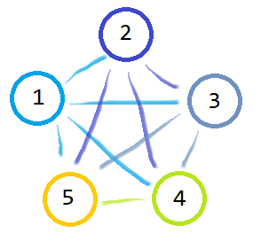

從上圖可以得知直接全部檢測的話是4 x 5 = 20，如果扣掉重複，至少是4 + 3 + 2 + 1 = 10，但真正的問題是，**就算1和3距離這麼遠，也照樣會檢查它們**，那有沒有方法能解決這種狀況呢?

這就是文章的主要內容，**QuadTree**。

## 1. 什麼是QuadTree?

四叉樹(QuadTree)是一種劃分2D區域的樹狀資料結構，類似一般的二元樹，但子節點是4個，而不是2個。

區域的劃分架構類似這樣 :

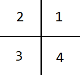
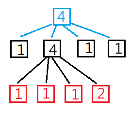
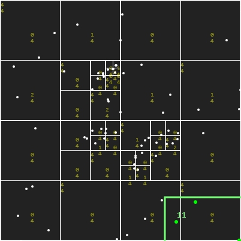
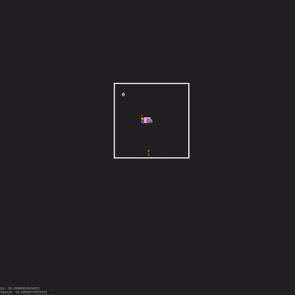

並限制每個區域能容納的上限，當超過後就將該區域再往下分割4塊，這樣就能夠將每個物體進行區域分類，這樣在檢查的時候就可以鎖定部分區域的物體，從而增加效率。

## 2. 插入流程:

假設我先設定每個區域只能容納4個物體，只要超過該容量，就要分割該區域。

左圖方形區域已經有4個物體，想再加入第5個時，就必須分割成4個子區域，再將第5顆分類到最近的左上角區域中，如右圖:

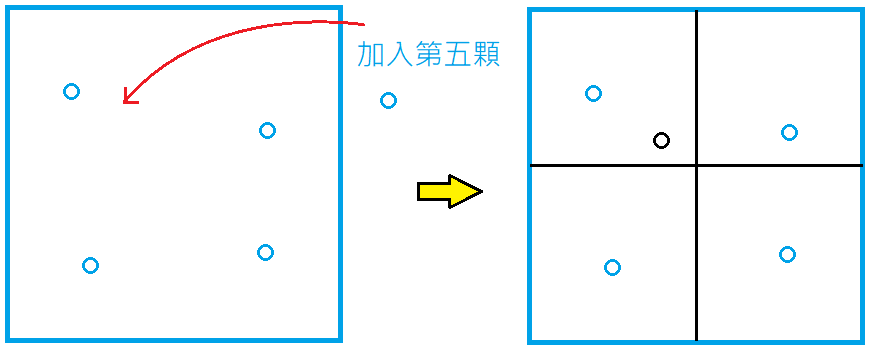

以此類推，當要放入第9顆物體時，發現黑色區域也滿了，所以就再往下分割紅色區域，並放入離該物體最近的右下角區域中，如下圖:

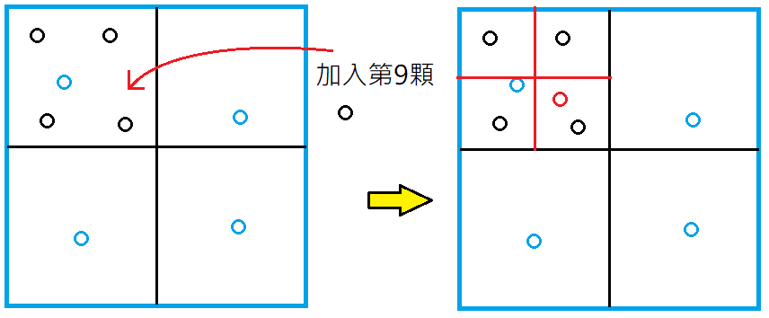

最後，就可以得出這樣的樹狀結構，這就是為什麼會叫做4叉樹的原因，如下圖:

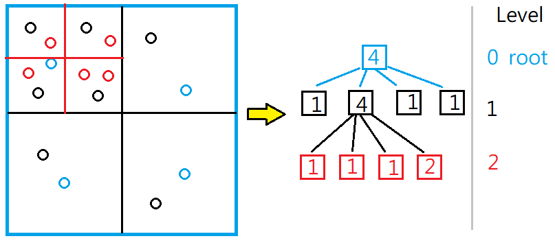

## 3. 搜尋流程:

給定一搜尋範圍，並逐一排除不可能的區域，最後取得搜尋範圍內的物體。

 

接續前面插入的狀態，假設我要檢測綠色框框內的物體是否發生碰撞，步驟如下 :

1. 與藍框區域作碰撞檢測，發現有所交集，檢測藍色區域的物體是否包含在綠框中，發現並沒有。
2. 與藍框的黑色子區域作檢測，發現只與左上的區域有所交集，所以排除另外三個區域，並發現有2個物體包含在綠框內。
3. 再往下檢察左上黑框的紅色子區域，並排除左上、左下，發現有3個物體在綠框內，紅框沒有子領域，走訪結束。

最後回傳搜尋到的5個物體。

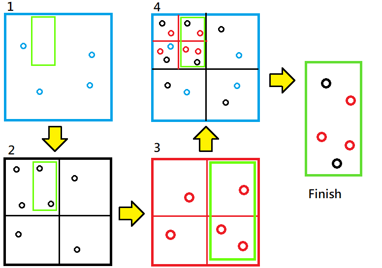


如果是碰撞檢測的應用的話，就是把綠框換成該物體周圍可能發生碰撞的範圍，再來套入搜尋，就能更加簡化碰撞檢測的流程，如下圖 :

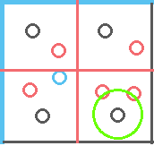

假設要檢查綠色圈圈與那些物體發生碰撞，透過前述的篩選流程，搜尋到最後，只要針對和綠圈區域相交的3個物體檢測就好，以此達成碰撞效率優化。

這就是四叉樹的原理，接著進入實作環節吧。

## 4. 實作QuadTree–插入

先整理大致的插入順序:

1. 如果該點不屬於A區域，直接結束
2. 如果該點屬於A區域，且A區域容量還夠的時候，將該點加入A區域
3. 如果A區域容量不夠時，將A區域劃分4個子區域，並將該點加入離它最近的子區域

建立基本物件 :
```js
class Point {
    constructor(x, y) {
        this.collisionType = "point";
        this.x = x;
        this.y = y;
    }
}

class Rect {
    constructor(x, y, w, h) {
        this.collisionType = "rect";
        this.x = x;
        this.y = y;
        this.w = w;
        this.h = h;
    }
}
```
四個子區域的規劃:

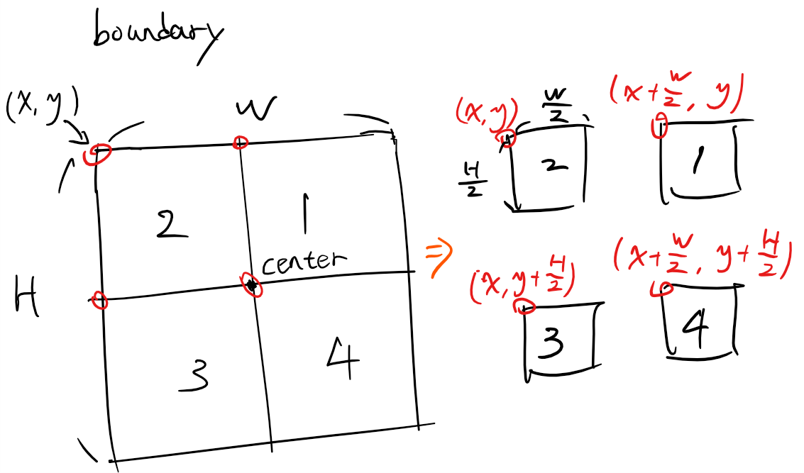

並依照前述所說的插入順序，來建立QuadTree :
```js
class QuadTree {
    constructor(boundary, level) {
        this.MAX_OBJ = 4;// 該容器最大容量
        this.MAX_LEVEL = 5;// 最大深度

        this.objs = [];// 該容器的物體集合
        this.areas = [];// 四塊子區域
        this.level = level || 1;//當前深度

        this.boundary = boundary;// 容器範圍(Rect)
    }

    /*
    如果該點在範圍內，且容量也夠的話就新增該點至區域內，或是到達最大深度也直接新增
    到達容量上限後，就分割出四個子領域，再將物體分類至最靠近的子領域中
    */
    insert(object) {
        // 先確認物體是否在邊界內
        if (!CheckCollision(this.boundary, object)) return false;

        // 如果當前容量與深度未達上限，就直接新增該物體
        if (this.objs.length < this.MAX_OBJ || this.level >= this.MAX_LEVEL) {
            this.objs.push(object);
            return true;
        }
        
        // 如果容量達上限，且沒有子領域的話，分割出四個子領域
        if (this.areas.length <= 0) this.subdivide();

        // 嘗試給子領域新增該物體
        for (let area of this.areas) {
            if (area.insert(object)) return true;
        }
    }

    subdivide() {
        let x = this.boundary.x, y = this.boundary.y;
        let w = this.boundary.w, h = this.boundary.h;

        // 矩形以左上為基準，依照各象限順序建立子領域，並新增到areas中
        this.areas.push(new QuadTree(new Rect(x + w / 2, y, w / 2, h / 2), this.level + 1));// topRight
        this.areas.push(new QuadTree(new Rect(x, y, w / 2, h / 2), this.level + 1));// topLeft
        this.areas.push(new QuadTree(new Rect(x, y + h / 2, w / 2, h / 2), this.level + 1));// bottomLeft
        this.areas.push(new QuadTree(new Rect(x + w / 2, y + h / 2, w / 2, h / 2), this.level + 1));// bottomRight
    }

    show(ctx) {
        // 繪製邊界
        ctx.strokeStyle = "#FFF";
        ctx.strokeRect(this.boundary.x, this.boundary.y, this.boundary.w, this.boundary.h);

        // 顯示物體數/容量數，Debug
        drawString(ctx, this.objs.length + "\n" + this.MAX_OBJ,
            this.boundary.x + this.boundary.w / 2, this.boundary.y + this.boundary.h / 2,
            "rgba(255,255,0,0.5)", 10, "consolas",
            0, 0, 0);

        // 往下繪製所有子領域區塊
        if (this.areas.length != 0) {
            for (let area of this.areas) {
                area.show(ctx);
            }
        }

        // 繪製出這塊領域的物體
        for (let obj of this.objs) {
            ctx.beginPath();
            ctx.arc(obj.x, obj.y, 3, 0, Math.PI * 2);
            ctx.stroke();
        }
    }
}
```

至於程式中CheckCollision(ObjectA, ObjectB)，就是單純的點與矩形的碰撞檢測，請參考結尾附上的Code。

使用方法 :
```js
// 建立QuadTree
var qt = new QuadTree(new Rect(0, 0, Width, Height));

// 新增物體
qt.insert(new Point(X, Y));

// 在Canvas中顯示分割與物體狀況
qt.show(Context);
```

如此一來就能建立基本可新增物體的QuadTree了。

基本插入範例，滑鼠點擊即可新增物體。新視窗執行 : <a class="link" href="/downloads/js_QuadTree/article/EP1-Insert&show-noLoop" target="_blank" rel="noopener">Here</a>

<script async src="//jsfiddle.net/davidhsu/mpr70djv/7/embed/result/dark/"></script>

然後可以看到，每當一個區域插入4個物體後(MAX_OBJ = 4)，就會將該領域往下分割4個子區域，最多分割5層(MAX_LEVEL = 5)。


## 5. 實作QuadTree–搜尋

搜詢的大致順序 :

1. 如果搜尋範圍跟當前領域相交，檢查該領域有多少物體包含在搜尋範圍中，並增加至陣列中
2. 當該領域有子區域時，繼續往下檢查有多少物件包含在搜尋範圍內
3. 直到所有搜尋範圍內的區域都被檢測過，回傳所有在搜尋範圍內的物體

可以比對一下上面講的搜尋流程，應該會更清楚。

根據上述步驟，在QuadTree中加入query這個function :
```js
query(range, found){
    // 如果沒有給定回傳的陣列，就建立一個
    if(!found) found = [];

    // 判斷搜尋範圍(range)是否與當前領域有相交，沒有就直接跳掉，以節省效率
    if (!CheckCollision(this.boundary, range)) return;

    // 如果搜尋範圍跟當前領域相交，檢查該領域有多少物體包含在搜尋範圍中，並增加至found
    for(let p of this.objs){
        if (CheckCollision(p, range)){
            found.push(p);
        }
    }
    
    // 當該領域有子區域時，繼續往下檢查有多少物件包含在搜尋範圍內
    if(this.areas.length != 0){
        for(let area of this.areas){
            area.query(range, found);
        }
    }

    // 完成搜尋，回傳結果
    return found;
}
```

而使用方法也非常簡單，給定一個搜尋區域，接著query就會直接撈出所有在搜尋範圍內的物體了 :
```js
// 假設queryTree已經新增一些物體了
// 建立一個搜尋範圍
var checkRange = new Rect(20, 40, 150, 150);

// 套用搜尋範圍至queryTree取得範圍內的物體
var objects = queryTree.query(checkRange);
```

基本搜尋範例，滑鼠點擊新增物體，移動可取得範圍內的物體。新視窗執行 : <a class="link" href="/downloads/js_QuadTree/article/EP2-query" target="_blank" rel="noopener">Here</a>

<script async src="//jsfiddle.net/davidhsu/3rawty40/37/embed/result/dark/"></script>

## 6. 實際應用

我將正常的碰撞檢測與QuadTree檢測放在一起做比較，可以清楚的看到，當物體數量到2000時，No QuadTree的檢測方法已經無法負荷，畫面有明顯卡頓。換成QuadTree檢測後，就只掉一點FPS，透過比對，可以明顯看到效能的提升。

每當物體碰撞時變成白色，滑鼠點擊新增100個物體，按下按鈕以切換不同檢測模式，觀察效能的差距 :

在新視窗執行 : <a class="link" href="/downloads/js_QuadTree/article/EP3-ObjectTest" target="_blank" rel="noopener">Here</a>

<script async src="//jsfiddle.net/davidhsu/3hz0jdse/56/embed/result/dark/"></script>


## 7. 總結

QuadTree或許不是最好的多物體檢測法，但多數狀況下還堪用，至於QuadTree優化的部分，可以參考這篇文章，講得非常清楚。

這邊預計要再補上QuadTree跟其他檢測法的優缺點，但目前只研究QuadTree，所以無從比較，日後補上。

文章中所有的Source Code都在Github中 : https://github.com/md9830415/JS-QuadTree

大概就是這樣了，下期再見，掰掰。


## 8. 參考資源
- [Coding Challenge #98.1: Quadtree – Part 1](https://www.youtube.com/watch?v=OJxEcs0w_kE)
- [Quick Tip: Use Quadtrees to Detect Likely Collisions in 2D Space](https://gamedevelopment.tutsplus.com/tutorials/quick-tip-use-quadtrees-to-detect-likely-collisions-in-2d-space--gamedev-374)
- [Efficient (and well explained) implementation of a Quadtree for 2D collision detection](https://stackoverflow.com/questions/41946007/efficient-and-well-explained-implementation-of-a-quadtree-for-2d-collision-det)
- [JavaScript QuadTree Implementation](http://www.mikechambers.com/blog/2011/03/21/javascript-quadtree-implementation/)