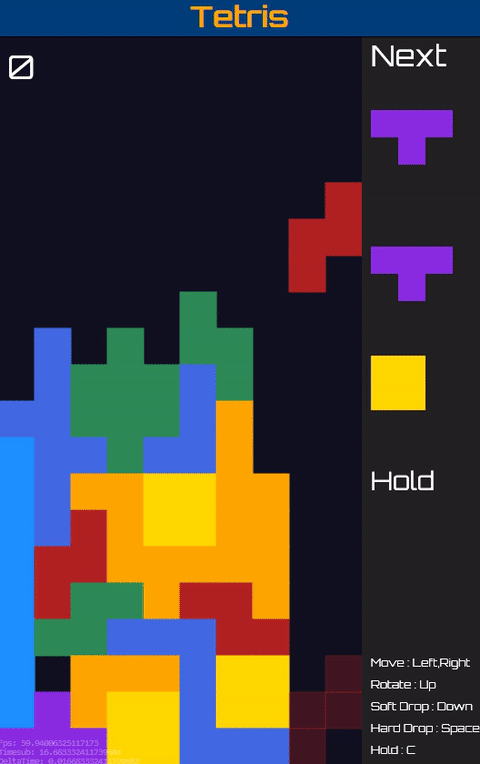

點此遊玩 : [ver.0.3](https://davidhsu666.com/downloads/js_Tetris/ver0.3/)

Source Code : [Github](https://github.com/beadx6ggwp/Tetris)

遊玩方式 :

- 移動方塊 : 左鍵、右鍵
- 往下移動 : 下鍵
- 直接放置方塊 : 空白鍵
- 保留/交換方塊 : C鍵
 

遊戲目標 : 越高分越好

 

目前功能:
- 基本操作與消除
- 底部的方塊位置預覽
- 能從右側得知接下來的方塊