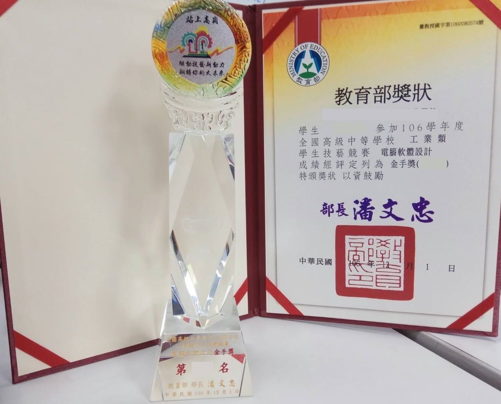
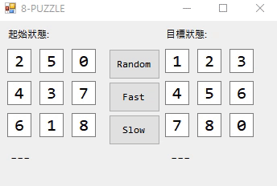

# 工科賽-軟體設計 歷屆試題解答

## 前言:

名次不高，這篇文只是單純分享，想看高手的心得，直接Google “ACM ICPC 心得”

我是106屆工科軟體競賽選手，覺得高職選手的資源不是很多，如果沒有老師、學長指導、沒有解答、也沒有累積相關知識技術的底，想拿前段名次會辛苦很多。

先簡單講講，所以可能有點亂，主要是該寫甚麼我也不清楚，工科軟體跟TOI比起來，知名度跟難度都差滿多的，所以也沒什麼人在關注或是討論題目，資源自然就少，大多只能靠學長或老師傳承解答。

高職的比賽，沒興趣不太建議靠比賽升學，做選手學東西就行，因為沒有很好的名次加上備審，不好上前段國立，所有國立科大資工開放的總名額大概只有30個左右，採計的比賽也不只工科賽，所以就算前15名也不見得能上國立。
 
## 全國工科技藝競賽 軟體設計在比什麼:

簡單來講就是用程式邏輯來解各種應用問題，但比UVA、IOI簡單，比較偏向應用一些吧，可以翻下面的題庫來看看在比什麼。 像是8-Puzzl轉盤，要在解題的時候去思考，如何讓電腦找到最少步數，相比傳統解題競賽，較著重在功能呈現上。

相關文章: [用BFS解8-Puzzle問題](http://davidhsu666.com/archives/csharp-bfs-solve-8-puzzle/)

## 準備方式:

語言建議用C#(至少要會哪些之後再補好了)。

建議是在暑假的時候先看完一到兩本演算法或資料結構的書(推薦[啊哈!圖解演算法](https://www.tenlong.com.tw/products/9789863474364)、[大話資料結構](https://www.tenlong.com.tw/products/9789866072116))，每天看一個段落，理解後就實做一次，很快就能看完了，以我來說大約一個月。

差不多開學後，開始練習工科賽題目，我是覺得工科賽歷屆題目就直接拿來計時比較實在，不然沒人幫你出題目，要想出能提升自己技術的題目內容其實挺難的，然後在11月前把工科北軟歷屆解完。

11月前記得也要寫學科，學科這邊就不用寫太多，覺得自己的相關知識差不多後，寫工科的99~104，如果每張不看解答或查資料，都有90左右，就差不多了，建議寫完就算對了也要在旁邊補上解法，這樣到時候比賽前複習才比較方便。

接著11月初，如果你是台北人，建議參加北軟，模擬一些臨場感，因為當你有所準備時，上場真的會很緊張，不然也沒什麼機會能模擬比賽了….。就算不是也沒關係，北軟比完會釋出題目，把它全部做完。

接著補一些自己當初不會或是卡住的內容，花點時間研究，並給自己出模擬試題，檢查自己哪些觀念不太夠。

如果你都完成了，就準備比賽拿金手吧。

## 雜談:

要拿金手比IOI培訓營簡單很多，感覺教育部也沒特別規定高職的程式設計課程要怎麼上，就變成看學校老師個人造化的感覺。 

別校選手說他們老師也是不推薦比賽，他參賽的原因只是科排第一，被科主任盧過來的。

全台60幾所高職報名軟體設計，真正有在訓練選手的也就那幾間，感覺其他很多都是被學校盧過來參加，或是覺得有趣隨便報名，反正校內選拔也沒人在搶，所以比賽水平自然沒有IOI那麼高。 

大概是這樣吧，我自己還有一些想法跟心得，只是不曉得怎麼寫。 剩下看要問什麼吧，一些比較深的演算法，我答不出來可以去[這一串問](https://forum.gamer.com.tw/C.php?page=1&bsn=60076&snA=3146926)，滿多人可以幫忙的。

電腦修護那塊，我伺服器沒什麼研究，單晶片當初有協助同校選手，所以還算幫得上忙吧，有問題可以問問看。

## 解答:

歷屆題目的程式碼，這些題目解答都是我自己寫的，雖然寫得很爛，但至少能解出題目要求的解答，所以寫法有看不懂的地方，我看一下題目跟Code都能回答。

這邊放北軟的歷屆，主要是我覺得北軟的題型跟工科賽幾乎一樣，而且出題老師也跟工科賽有重疊，因為這幾年都有類似的題目出現，加上北軟在工科賽之前比，非常值得做參考。

<mark>工科賽軟體設計</mark>:
 歷屆題目 : [Here](https://drive.google.com/drive/folders/0B7jQGIvVP5gtWEVuVUtxb2tUR3M)
 96~106屆參考解答 : [Here](https://github.com/md9830415/Skills-Competition-Software)

<mark>北市軟體設計競賽(高工)</mark>:
 歷屆題目 : [Here](https://drive.google.com/drive/folders/0B7jQGIvVP5gtbXdwZUNoVHRJTjQ)
 99~106屆參考解答 : [Here](https://github.com/md9830415/Taipei-Software-Competition)
