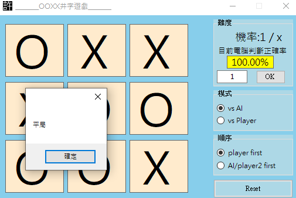
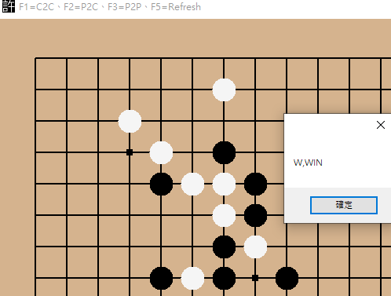
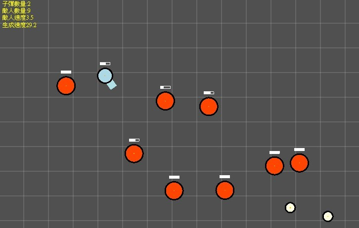
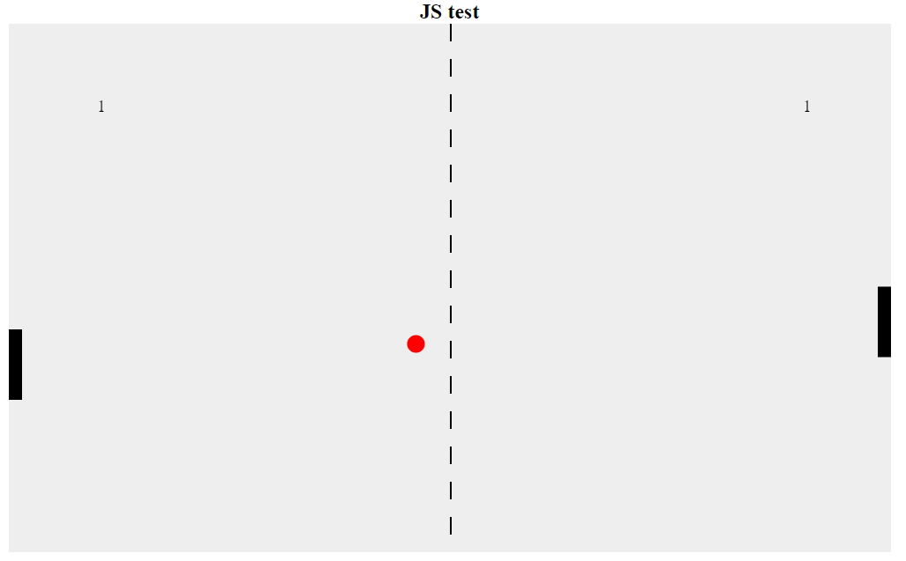
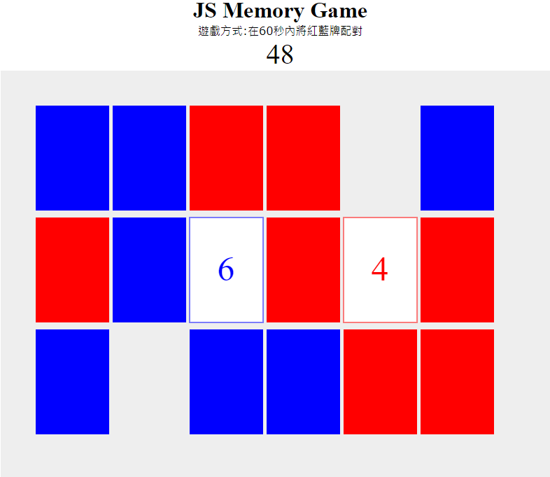
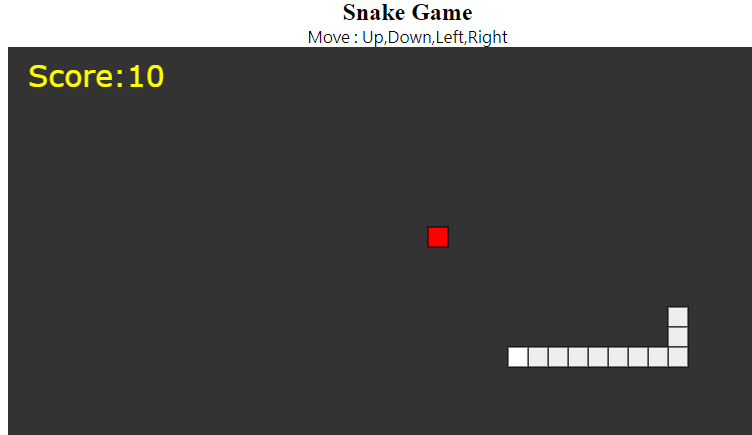
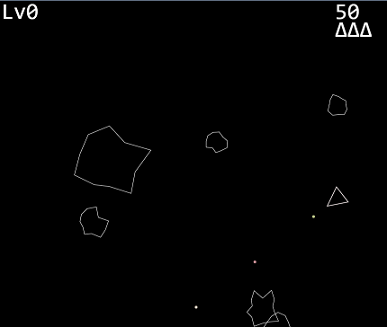
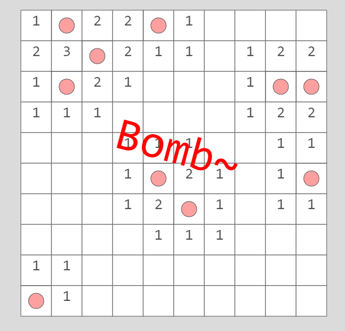
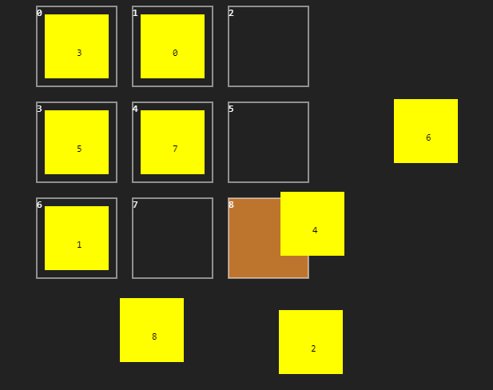

Source Code : [Link](https://github.com/beadx6ggwp/toy-project)

## C# Tic-Tac-Toe

與電腦對戰OOXX

## C# 五子棋

透過累計棋盤分數加權的方式，來完成電腦VS玩家的互動

## C# Ball game

平面射擊遊戲，敵人會一直追著玩家，透過WASD移動，滑鼠左鍵射擊，想嘗試模仿diep.io

## js_pingpong

乒乓球對打

線上執行 : [Link](https://davidhsu666.com/downloads/js_pingpong/jstest.html)

第一次學JS，讓我對一些2D平面遊戲撰寫更有了解

## js_memorygame

翻牌記憶遊戲

線上執行 : [Link](https://davidhsu666.com/downloads/js_memorygame/)

## js_snake

經典貪食蛇

線上執行 : [Link](https://davidhsu666.com/downloads/js_snake/)

## js_gerrnrainT

仿造駭客任務的特效

線上執行 : [Link](https://davidhsu666.com/downloads/js_gerrnrainT/)

## js_AsteroidGame

宇宙飛機打隕石

第一次認識Coding train這個頻道，從接觸這頻道後讓我有了一個契機去了解各式演算法與應用

線上執行 : [Link](https://davidhsu666.com/downloads/js_AsteroidGame/)

參考Coding train : https://www.youtube.com/watch?v=hacZU523FyM

## js_Minesweeper

踩地雷，線上執行 : [Link](https://davidhsu666.com/downloads/js_Minesweeper/Minesweeper0.1/)

## js_dragTest

嘗試製作簡易圖形物件

線上執行 : [Link](https://davidhsu666.com/downloads/js_dragTest/test1/)

