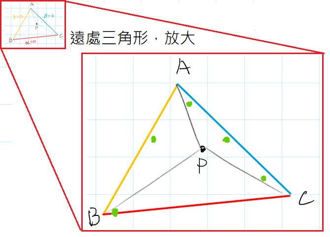
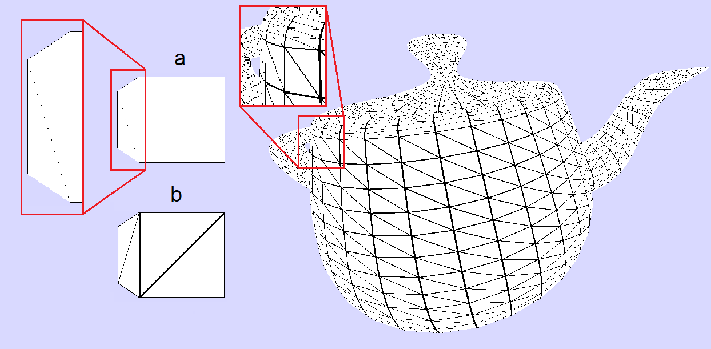



<br>

## 簡介

參考這幾篇文章，並介紹線框繪製的問題點與解決方法:
- [Single-Pass Wireframe Rendering, Siggraph 2006][3]
- [Solid Wireframe, NVIDIA Whitepaper 2007][1]
- [Two Methods for Antialiased Wireframe Drawing with Hidden Line Removal, SCCG '08][4]

文章總結的線框渲染方式都非常簡單直觀，就是在Shader時，找出三角形內的動點P與邊界的最短距離d，當`d < LineWidth`時就代表P點屬於線框的部分，那就繪製線框的顏色，然後再透過smoothing function給LineWidth這個閥值做平滑，讓線段邊緣的顏色遞減，就這樣

只是想嘗試敘述研究者一開始所遇到的問題，並循序漸進的解決，到最後得出結論，來設想遇到問題該怎麼著手解決


使用[myMiniRender][sourcecode]渲染的結果 :


<br>

## 介紹

在建立了基本渲染流水線後，原本想要方便Debug，所以在pipeline外，將投影後的頂點座標連成線段三角形，來畫出基本線框方便觀察，而這大致就是gl.LINES的方式

```C++
TextureShader shader;
model = model_head;
for (int i = 0; i < model->nfaces(); i++) {
    Vec4f screen_coords[3];// 投影轉換後的座標
    for (int j = 0; j < 3; j++) {
        screen_coords[j] = shader.vertex(i, j);
    }
    // 先忽略PixelShader，現在要的是線框，不是像素著色
    // triangle(screen_coords, shader, device); 
    drawTriangleLine(screen_coords, black);// 類似gl.LINE的線段繪製
}
```


效果如上面兩張圖，但背面的線條會導致畫面很雜亂，為了**正確顯示背部消除與物體遮擋**，所以需要特別處理

背部消除的線條，以往是分成兩次繪製(Two-pass)的方式，指同個畫面總共經過了兩次pipeline處理，讓物體與線框獨立繪製，並產生兩個深度緩衝(Z-buffer)，1.是繪製物體時的Zo(object)，2.是繪製線框時的Zw(wireframe)，通常繪製的順序是先繪製物體表面，然後在繪製線框時，比較Zw與Zo的深度，來判斷線框跟物體之間的前後遮擋

<br>

## 問題

使用Two-pass這種方法繪製背部消除的線段時，會有幾個限制:
1. 無法**更改線條寬度**、**插值線段顏色**等樣式處理
2. 無法進行反鋸齒的處理，因為反鋸齒會需要透過流水線處理Blending等操作
3. 物體與線段會使用一樣的頂點，也就代表共用一樣的深度，導致線框深度跟物體深度Z-buffer判斷遮擋的時候，深度一樣，不知道是物體在前，還是線段在前，導致Z-fighting

> 細節補充 :<br>第一個pass渲染物體並產生Zo，而第二個pass詳細步驟是: 1.將線段頂點處理投影變換(MVP)後得到線段頂點的z-buffer, Zw，2.在光柵化線段像素P時，將P點的線段Zw與物體Zo的深度進行比較，`if(Zw(P) <Zo(P)) draw(P);`，以此來繪製正確的遮擋線段。<br>
> 但這時物體與線段的pass都用一樣的頂點，可能會導致Z-fighting(深度z值一樣不曉得誰前誰後)或不正確的遮擋，所以需要透過深度偏移(depth bias offset)，將物體的深度放在模型後面一點的位置，才能正確讓線框繪製在物體前面。<br><br>
> 雖然**繪製出的效果不錯**，不過z-buffer的值是透過Perspective的非線性轉換得來，還有精度問題，所以在某些地方可能因為這一點點的前後差距導致一些本該被遮擋的區域未被遮擋，所以在某些時候會有問題

如圖(a)中的紅色的線段能正確被遮擋，且因為有深度偏移，讓線段頂點在物體的前面，所以第一次pass繪製物體產生Zo後，第二次pass在繪製線段時，只要比較線段中P點深度有沒有比Zo更近即可判斷是否繪製，以此達到線段遮擋與背部消除的效果，圖(b)引用[Line Drawings from 3D Models, p18][2]


而這篇文章，希望透過循序漸進的方式，介紹可以在一個pass內繪製物體與線框的方法，僅透過Shader繪製時傳入的重心座標與頂點，即可在三角形邊緣繪製不同的圖案，而且因為是single-pass，相對來說效能更好，使用上也簡單好用

這方法的缺點大概就是框線繪製在三角形內部，所以會使物體輪廓看起來更薄一些，也因為只在內部繪製，所以只有內側有反鋸齒效果

<br>


## 解決方法與原理

必要知識 : [重心座標的推導與使用 Barycentric Coordinates](https://davidhsu666.com/archives/barycentric-coordinates/)、[動畫圖解 Rasterizer Algorithm Explanation](https://www.youtube.com/watch?v=t7Ztio8cwqM)

如果要在single-pass下完成的話，勢必要在「Shader繪製物體的時候**一起畫出線段**」，而在光柵化三角形(Rasterization)的時候，會有一個動點P去走訪三角形的所有**像素區域**，並給Shader傳入P點的重心座標


### 單純使用重心座標 const offset
前面提到過，重心座標(bar)alpha、beta、gamma就是頂點A,B,C對面那塊區域的面積比，也就是說「**當某一塊面積比為0時，就代表P點在三角形的邊上**」

[線上操作範例](https://www.geogebra.org/m/ZuvmPjmy) : 可拖動重心座標在三角形的邊界上移動，去觀察重心座標的值





如左圖，當重心座標在藍色線上時，beta比的面積為0，代表這個點在邊上，但光柵化時的像素渲染是一格一格的，很多時候P根本不可能剛好在邊界上

如右圖，尤其是遠處的小片三角形，所佔有的像素區域非常少，整面三角形符合offset範圍的P點只有五個，那就會導致遠處物體看起來只剩下幾個點而已

如圖中的綠點，要是只在邊上才繪製的話，線會斷斷續續的，而const offset這個方法，就是透過offset來修正這段誤差，只要任一個重心座標(面積比)`alpha, beta, gamma <= offset`，就認定這個P點在三角形的邊界上，繪製線段顏色，


```C++
struct LineShader : public IShader {
    // Vertex Shader: 處理座標投影轉換
    virtual Vec4f vertex(int iface, int nthvert) ...

    // Pixel Shader: 處理P點的像素顏色, Vec3f bar為重心座標alpha, beta, gamma
    virtual bool fragment(Vec3f bar, UI32& color) {
        float offset = 0.01; //容許的誤差範圍
        if (bar[0] <= offset || bar[1] <= offset || bar[2] <= offset) 
            color = 0x000000; // 黑色線框
        else 
            color = 0xFFFFFF; // 物體原本的顏色,這裡用白色代替
        return false;
    }
};
```
上面這段Shader code會執行出這個結果:


可以看到確實有線框了，但有些區域透過offset還是無法修正這些誤差，所以就會導致邊框不連續，而這繪製方法就是封面圖的(a)

而且這種繪製法有個很明顯的缺點，就是線段寬度不一致，透過面積比來判斷是否在邊上，很容易被邊長的比例所影響，導致時粗時細(b)，有些線段甚至沒有繪製

### 最短邊距法 shortest distance to the edge

這稱呼只是單純直翻，這還只是一個小撇步，應該沒有特定的名字


為解決剛剛const offset厚度不一致的問題，衍伸的想法就是先找出P點離邊界最近的「像素距離d」是多少(表示作用的區域是Screen Space)，再透過一個width當作閥值，當`d < width`的時候才繪製線條，這樣就可以確保邊界繪製的寬度為width

而找出d1, d2, d3的方法也很容易，步驟是:
1. 邊向量外積得到三角形面積，$Area = \bigtriangleup ABC = \frac{1}{2}(\overrightarrow{AB} \times \overrightarrow{AC})$
2. 重心座標就是面積比，得出$\bigtriangleup A = Area \times \alpha,~~ \bigtriangleup B = Area \times \beta ,~~ \bigtriangleup C = Area \times \gamma $
3. 有了三塊區域的面積後就能直接根據面積公式$h= 2(\frac{Area}{L}) $, 得出d1, d2, d3
4. 再取最小值即可得到`d = min[d1, d2, d3]`

有了d之後就能對這個最短距離進行判斷，如果小於寬度就繪製線段顏色，如圖(b)

```C++
struct WireframeShader : public IShader {
    Vec2f screen_coords[3];
    Vec3f wire_color = Vec3f(0, 0, 0); // 黑色線框
    Vec3f fill_color = Vec3f(1, 1, 1); // 物體顏色, 這裡先用白色代替 
    float width = 0.5; // 線框寬度
    // Vertex Shader
    virtual Vec4f vertex(int iface, int nthvert) {
        // ...處理座標轉換省略
        // 紀錄這片三角形投影後的三個頂點,
        // 作用的地方是光柵時的螢幕座標系, Clip Space /w->NDC->Screen Space
        screen_coords[nthvert] = proj<2>(pos / pos[3]);
        return pos;
    }
    // Pixel Shader: 最短邊距法線段繪製
    virtual bool fragment(Vec3f bar, UI32& color) {
        float d = getMinDistToEdge(bar);

        if (d < width) c = wire_color;
        else c = fill_color;
        
        color = rgb2hex(c[0] * 255, c[1] * 255, c[2] * 255);// 0~1轉換成0~255
        return false;
    }
    
    float getMinDistToEdge(Vec3f bar) {
        float dist[3];
        auto getLength = [&](Vec2f& v) {return std::sqrt(v.x * v.x + v.y * v.y); };
        // 透過三個頂點與重心座標回推掃描線p點，proj<2>:將Vec3捨棄z值轉換為Vec2
        // P = A*alpha + B*beta + C*gamma
        Vec2f p = proj<2>(
            screen_coords[0] * bar[0] + 
            screen_coords[1] * bar[1] + 
            screen_coords[2] * bar[2]);

        Vec2f v0 = screen_coords[2] - screen_coords[1];
        Vec2f v1 = screen_coords[2] - screen_coords[0];
        Vec2f v2 = screen_coords[1] - screen_coords[0];
        // v1,v2外積取得三角形面積，原本要在乘上的1/2，不過後續的運算會消掉
        float area = abs(v1.x * v2.y - v1.y * v2.x);

        // area*alpha:因為重心座標即為為a,b,c三區域佔總體的面積比值
        // 可以直接將整體面積(Area)乘上a,b,c重心座標來取得各塊區域面積
        // 再透與三塊面積取高，得出p點與各邊界的距離d為
        dist[0] = area * bar[0] / getLength(v0);
        dist[1] = area * bar[1] / getLength(v1);
        dist[2] = area * bar[2] / getLength(v2);

        return min(dist[0], min(dist[1], dist[2]));
    }
};
```
這段Shader code會執行出這樣的結果:


圖(a)這張就是封面圖的(c)部分，稍微換個顏色，可以明顯看到，這樣的線框已經足夠使用了，圖(b)也能任意控制線框寬度與著色樣式)，但是線框看起來還是有一點粗糙，所以接著最後一步處理，反鋸齒


### 反鋸齒處理Antialiased Wireframe Drawing

圖片引用自[Solid Wireframe, NVIDIA Whitepaper, p10, p11][1]


接續剛剛的最短邊距法，可透過圖(a)的這個平滑函數，套用在邊界處，讓邊界外的顏色遞減，並進行Alpha blending將線框與物體按照衰減度混色，即可得到反鋸齒的效果

```C++
struct WireframeShader : public IShader {
    Vec2f screen_coords[3];
    Vec3f wire_color = Vec3f(0, 0, 0); // 黑色線框
    Vec3f fill_color = Vec3f(1, 1, 1); // 物體顏色, 這裡先用白色代替 
    float width = 2; // 線框寬度
    // Vertex Shader 同上
    virtual Vec4f vertex(int iface, int nthvert)...

    // Pixel Shader: 反鋸齒的最短邊距法繪製
    virtual bool fragment(Vec3f bar, UI32& color) {
        float d = getMinDistToEdge(bar);
        // 對線框寬度的+/-1邊界進行平滑
        // 帶入最短距離d得出width邊界所對應的線框顏色的強度 I
        // 如果d<=width-1，那I就一定是1
        float I = smoothstep(width - 1, width + 1, d);
        // 進行Alpha blending，將線框與物體顏色照比例混合
        Vec3f c = wire_color * I + fill_color * (1.0 - I);
        color = rgb2hex(c[0] * 255, c[1] * 255, c[2] * 255);
        return false;
    }
    float smoothstep(float edge0, float edge1, float x) {
        // Scale, bias and saturate x to 0..2 range
        x = clamp((x - edge0) / (edge1 - edge0), 0.0, 2.0);
        return  exp2(-2 * x * x);
    }
    float clamp(double d, double min, double max) {
        const double t = d < min ? min : d;
        return t > max ? max : t;
    }
    float getMinDistToEdge(Vec3f bar)...
};
```

執行這段Shader code後，最終得到封面圖中間(b)的漂亮線框


<br>

## 應用與討論

前面講完原理後，簡單的介紹一些衍伸用法

### 虛線樣式

因為能求出在最短邊距，那麼就可以對物體邊界位置動態給定閥值，搭配其他搭配其他函數做出類似虛線、圖案，或透過Z值來繪製背面透明等線框效果

完整虛線樣式的效果可以參考這個[漂亮的線上範例][5]

![閥值函數圖, 參考\[4\]. ](img/虛線函數.png)


### 外側反鋸齒

而文章一開始的問題章節有提到過，這種方法繪製的反鋸齒只有內側，如圖(a)


有一種解決方法，就是讓線框往三角形內部偏移一點，這樣雖然會犧牲一點物體的輪廓大小，但應該是簡單有效的處理方式，只不過也不是正確的方式，因為不是跟背景色做Alpha blending

而[Two Methods for Antialiased Wireframe Drawing with Hidden Line Removal][4]的文章中，有提出一種方法叫做ID Buffer，雖然會犧牲一點效能，但能有效的解決外側反鋸齒的問題，有興趣可以看看

### 優缺點

這個Single pass render方法，有幾個優缺點
1. 能背部消除，且繪製的深度準確
2. 可透過插值、函數等方式更改線段樣式，如彩色、虛線等
3. 只需要一次pass，速度較快

缺點目前覺得就是只有內側能反鋸齒，在渲染大片三角形的模型中會有比較大的影響

而[Solid Wireframe, NVIDIA Whitepaper][1]中有提到說在頂點與觀察點非常接近，或是裁切處理的情況，會有一些問題，需要做特別的處理

<br>

## 結語

線框繪製也廣泛的應用在特殊風格渲染，如卡通著色、繪本風格等等的，這類著色風格被稱為Non-photorealistic Rendering


衍伸閱讀，參考資料中的這篇[Line Drawings from 3D Models][2]，裡面提供了非常多種線框繪製的方法，原本繪製線框只是為了Debug，但查了很多資料後才發現，線框的繪製也是一門學問

<br>

大致就是這樣，嘗試敘述並解決一個問題的文章，希望有解釋的淺顯易懂

Github專案: [https://github.com/beadx6ggwp/RenderLearningPlan](https://github.com/beadx6ggwp/RenderLearningPlan)

文章中渲染結果都使用這個版本繪製: [12.2 Lesson 6 Shaders(wireframe render & vertax-obj)](https://github.com/beadx6ggwp/RenderLearningPlan/tree/main/code/12.2%20Lesson%206%20Shaders(wireframe%20render%20%26%20vertax-obj))


<br>

## Reference

1. [Solid Wireframe, NVIDIA Whitepaper 2007][1]
2. [Line Drawings from 3D Models, Foundations and Trends in Computer Graphics and Vision 2019][2]
3. [Single-Pass Wireframe Rendering, Siggraph 2006][3]
4. [Two Methods for Antialiased Wireframe Drawing with Hidden Line Removal, SCCG '08][4]
5. [webgl-wireframes, github][5]
6. [glsl-solid-wireframe, github][6]
7. [WebGL 单通道wireframe渲染, 知乎][7]
8. [Wireframe-的实现, 知乎][8]
9. [Wireframes with barycentric coordinates, blog][9]
10. [Flat and Wireframe Shading, blog][10]
11. [Wireframe shader implementation, Cinder Forums][11]
12. [Real-Time Rendering.3rd, Book]
13. [卡通外描邊深入研究與Unity新管線功能使用分享][13]

[1]: https://developer.download.nvidia.com/SDK/10/direct3d/Source/SolidWireframe/Doc/SolidWireframe.pdf
[2]: https://arxiv.org/abs/1810.01175
[3]: http://www2.imm.dtu.dk/pubdb/edoc/imm4884.pdf
[4]: https://backend.orbit.dtu.dk/ws/portalfiles/portal/3735323/wire-sccg.pdf
[5]: https://mattdesl.github.io/webgl-wireframes/app/
[6]: https://github.com/rreusser/glsl-solid-wireframe
[7]: https://zhuanlan.zhihu.com/p/43139658
[8]: https://xiaoiver.github.io/coding/2018/10/22/Wireframe-%E7%9A%84%E5%AE%9E%E7%8E%B0.html
[9]: https://tchayen.github.io/posts/wireframes-with-barycentric-coordinates
[10]: https://catlikecoding.com/unity/tutorials/advanced-rendering/flat-and-wireframe-shading/
[11]: https://web.archive.org/web/20150906185520/https://forum.libcinder.org/topic/wireframe-shader-implementation
[13]:https://forum.gamer.com.tw/C.php?bsn=60602&snA=2983

[sourcecode]: https://github.com/beadx6ggwp/RenderLearningPlan