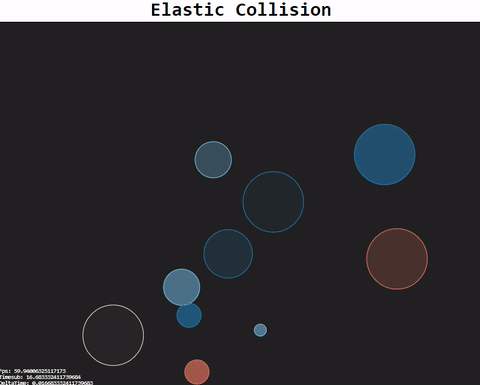
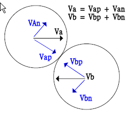

# Elastic-Collision

Elastic-Collision

Example

兩質量相同的物體

同質量，不同的角度

不同質量，不同角度

多顆球體的彈性碰撞效果

# How it works

## step

1. Find the time when two ball collide : D= R1+ R2
 where D=Distance between center of two balls , and R1/R2 is radius of each balls

2. Find the line connect center of two balls. and calculate the component of the velocitry for each ball alone the line connect those two balls.
 For example : Velocity for each ball is Va and Vb (before collision)
  Calculate Vap and Vbp. (and another normal component Van,Vbn)
3. It is become a 1D collision problem: ball A with velocity Vap collide with ball B with velocity Vbp . You should be able to calculate velocity after collision for each ball.
  for example:
  Vap2=((m1-m2)/(m1+m2))vap+ (2m2/(m1+m2))Vbp and
  Vbp2=(2 m1/(m1+m2))Vap+((m2-m1)/(m2+m1))Vbp
  The tangential component is not changed Van2=Van, and Vbn2=Vbn
4. Calculate the vector sum for velocity of each ball after collision
  Va2=Vap2+Van2 and Vb2=Vb2p+Vbn2 (vector summation)

參考資源(resource):

[Physics: Mechanics - Conservation of Momentum](https://www.youtube.com/watch?v=0sbzWZhOG10)

[Momentum in 2D - A Level Physics](https://www.youtube.com/watch?v=NzgIGd0MbR4&t=786s)

[The Physics of an Elastic Collision-director-online](https://www.youtube.com/watch?v=NzgIGd0MbR4&t=786s)

[http://www.hoomanr.com/Demos/Elastic2/](http://www.hoomanr.com/Demos/Elastic2/)

[Circle-Circle Collision Tutorial](http://ericleong.me/research/circle-circle/)

[Elastic collision-WIKI](https://en.wikipedia.org/wiki/Elastic_collision)

[Game Dev - Prevent overlap of particle](https://gamedev.stackexchange.com/questions/20516/ball-collisions-sticking-together)